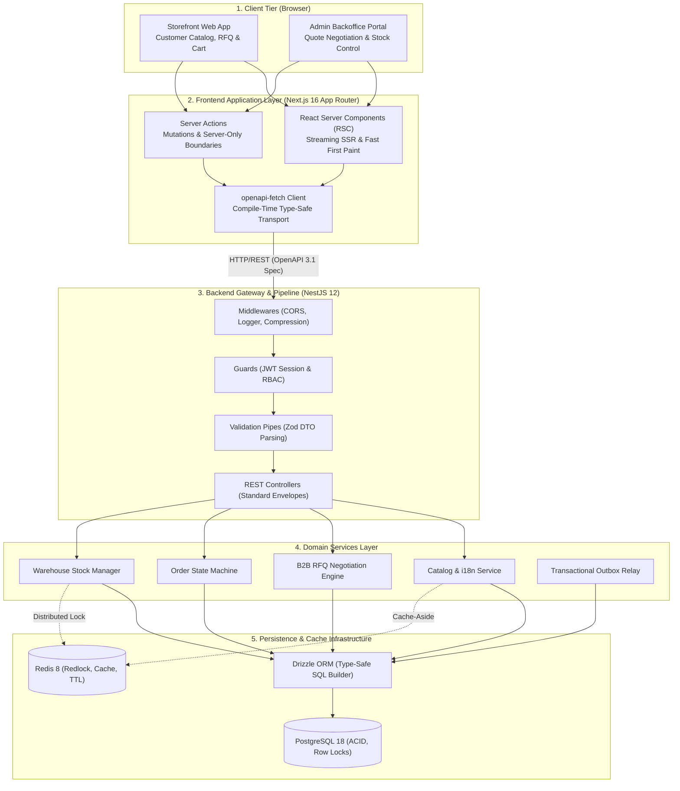

<div align="center">

# Hyundai E-Commerce Platform

### Enterprise B2B & B2C Industrial Power Equipment & Quotation Negotiation System

[](https://www.typescriptlang.org)
[](https://nestjs.com)
[](https://nextjs.org)
[](https://eslint.org)
[](https://bun.sh)
[](https://www.postgresql.org)
[](https://redis.io)
[](https://tailwindcss.com)
[](https://scalar.com)
[](https://sentry.io)
[](LICENSE)

</div>

---

## Overview

**Hyundai E-Commerce** is a modern, enterprise-grade industrial machinery e-commerce and B2B Request for Quotation (RFQ) platform. Built specifically for high-value power equipment (three-phase diesel generators, agricultural machinery, industrial water pumps, and emergency backup power solutions), the system features dynamic multi-tier quotation workflows, warehouse batch stock tracking, PayOS payment integration, and high-concurrency order settlement.

---

## Live Services & Port Matrix

| Service                 | Technology              | Local Port | Production URL                                                                    | Description                                              |
| :---------------------- | :---------------------- | :--------: | :-------------------------------------------------------------------------------- | :------------------------------------------------------- |
| **REST API Server**     | NestJS 12 + Drizzle ORM |  `:3000`   | [hyundai-ecommerce.onrender.com](https://hyundai-ecommerce.onrender.com/api/docs) | Core backend, database queries, and OpenAPI contract     |
| **Customer Storefront** | Next.js 16 (App Router) |  `:3001`   | [hyundainhatnang.ngxc.io.vn](https://hyundainhatnang.ngxc.io.vn)                  | Customer catalog, quote submission, and shopping cart    |
| **Admin Portal**        | Next.js 16 (App Router) |  `:3002`   | [admin.hyundainhatnang.ngxc.io.vn](https://admin.hyundainhatnang.ngxc.io.vn)      | Backoffice dashboard, quote approvals, orders, inventory |

---

## Architecture Overview

The repository adopts a **Decoupled Standalone Multi-Application Architecture (Polyrepo-Ready)**. Each package operates independently with its own configuration, dependencies, test runner, and localized `.github/` workflows:

```text
.
├── backend/            # NestJS 12 REST API Service
│   ├── src/modules/    # Domain modules (catalog, quotes, orders, warehouse, etc.)
│   ├── openapi.json    # OpenAPI 3.1.0 Contract Specification (Single Source of Truth)
│   ├── docs/standards/ # 11 Full Operational Engineering Standards
│   └── .github/        # Independent CI/CD (Postgres/Redis services, Render release)
│
├── admin/              # Next.js 16 Backoffice Admin Dashboard
│   ├── app/[locale]/   # App Router (Dashboard, Products, Quotes, Orders, Stock)
│   ├── src/lib/        # Zero-overhead typed client (`api` via openapi-fetch)
│   ├── docs/standards/ # Frontend Engineering Standards
│   └── .github/        # Independent CI/CD (Vercel deploy)
│
├── storefront/         # Next.js 16 Customer Storefront & B2B RFQ Portal
│   ├── app/[locale]/   # App Router (Shop, Products, B2B Quote Submission, Cart)
│   ├── src/lib/        # Typed API client with compile-time DTO schemas
│   ├── docs/standards/ # Frontend Engineering Standards
│   └── .github/        # Independent CI/CD (Vercel deploy)
├── docker-compose.yml  # Local PostgreSQL 18 & Redis 8 infrastructure
├── package.json        # Root coordination & verification scripts
└── .github/workflows/  # Thin Monorepo CI/CD orchestrators with path filtering
```

### System Data Flow Architecture



### Architectural Pillars

1. **Decoupled Standalone Applications**:
   - Zero workspace cyclic dependencies or compile-time coupling.
   - Ultra-fast LSP / TSServer response times (<200MB memory footprint).
   - Effortless zero-rework separation into 3 independent Git repositories whenever desired.
2. **Backend Delegation & Pure Single Source of Truth**:
   - Frontend applications (`admin`, `storefront`) act as pure API consumers without database dependencies.
   - Database operations (PostgreSQL, Drizzle ORM, ACID transactions, Redis Redlock) live strictly inside `backend/`.
3. **Contract-Driven API (OpenAPI 3.1 & Scalar)**:
   - Backend exports `backend/openapi.json` and serves live interactive docs at `/api/docs`.
   - Dual-mode type synchronization: offline `bun run types:sync` at root, or standalone `bun run types:pull` in each frontend.
4. **B2B Industrial Quotation Engine**:
   - High-value industrial machinery is sold via quote negotiation (`REQUESTED` → `REVIEWING` → `APPROVED` → `REJECTED` → `EXPIRED`).
   - DIN/ISO-compliant B2B commercial print documents and Excel export (`exceljs`).

---

## Key Engineering Trade-offs & Decisions

The platform architecture is designed with **Systems Thinking**, prioritizing data correctness, horizontal scalability, and low latency through 3 foundational trade-offs:

### 1. Zod Single Source of Truth (SSOT) vs Contract Drift

- **Problem**: In decoupled architectures, manually maintaining backend DTOs and frontend TypeScript interfaces inevitably creates contract drift, triggering unexpected 400/500 runtime errors during refactoring.
- **Decision**: Adopt Zod as the single source of truth (`createZodDto`). A single Zod schema defines the backend NestJS validation pipe, controller Swagger metadata, and generates the OpenAPI 3.1 contract (`backend/openapi.json`). Frontend applications consume synchronized typed definitions via `openapi-typescript` and `openapi-fetch`.
- **Trade-off**: Requires strict schema definition discipline and rigorous handling of nullable/optional fields up front, in exchange for **0% contract drift** and guaranteed compile-time detection of breaking API changes (`bun run check-types`).

### 2. Normalized Localization Table (1-N) vs Denormalized JSONB Storage

- **Problem**: Heavy industrial machinery requires multi-language support (`vi`, `en`) for localized names, SEO slugs, and large TipTap rich-text technical specifications. Hardcoding columns (`nameVi`, `nameEn`) does not scale with new locales, while storing the entire product schema in `jsonb` breaks relational integrity and hampers B-Tree indexing.
- **Decision**: Decouple translations into a dedicated `product_translations` table (1-N with `products`). Product names and slugs are normalized columns protected by composite unique indexes `(product_id, locale)` and `(slug, locale)`. Rich-text description AST is stored as `jsonb` within its corresponding translation record.
- **Trade-off**: Incurs `LEFT JOIN` overhead on catalog queries in exchange for third normal form (3NF) compliance, relational foreign key constraints, and seamless addition of future locales without schema migrations (`ALTER TABLE`).

### 3. Bidirectional Cursor Pagination vs Offset Pagination

- **Problem**: High-volume B2B orders, quotation revisions, and warehouse batch tracking lead to large tables. Traditional offset queries (`OFFSET 100000 LIMIT 20`) force the database engine to perform sequential scans over prior rows, resulting in high I/O latency and page drift (duplicate/skipped records) during active inserts.
- **Decision**: Implement bidirectional keyset/cursor-based pagination using composite ordering on `(created_at, id)` with UUIDv7 (`WHERE (created_at, id) < (:cursor_time, :cursor_id)`). Cursors are opaque base64 tokens encoding timestamp, record ID, and pagination direction (`next` / `prev`).
- **Trade-off**: Sacrifices random page jumping (e.g. jumping directly to page 47) in exchange for deterministic **$O(1)$ query time** (<10ms latency at arbitrary dataset depths) and complete immunity to page drift.

---

## Quickstart

### Prerequisites

- **Bun** `v1.4+` (`curl -fsSL https://bun.sh/install | bash`)
- **Docker & Docker Compose** (PostgreSQL 18, Redis 8)
- **Doppler CLI** (Optional, for production secrets management)

### 1. Launch Local Infrastructure

```bash
# Start PostgreSQL 18 and Redis 8 containers
bun run docker:up
```

### 2. Install Dependencies

```bash
# Install dependencies across all packages in one command
bun run install:all
```

### 3. Initialize Database & Seed Fixtures

```bash
cd backend
bun run db:migrate dev
bun run db:seed dev
cd ..
```

### 4. Run Development Servers

Run services simultaneously in separate terminals:

```bash
# Terminal 1: Backend API (http://localhost:3000 | Docs: http://localhost:3000/api/docs)
bun run dev:backend

# Terminal 2: Customer Storefront (http://localhost:3001)
bun run dev:storefront

# Terminal 3: Backoffice Admin Portal (http://localhost:3002)
bun run dev:admin
```

---

## Contract-Driven Type Synchronization

When backend APIs, DTOs, or routes are modified:

```bash
# Option A: Monorepo Mode (Offline, generates openapi.json and syncs types across packages)
bun run types:sync

# Option B: Polyrepo Mode (Run inside admin or storefront to pull schema from running API)
cd admin && bun run types:pull
cd storefront && bun run types:pull
```

---

## Root Orchestration Scripts

The root `package.json` provides scripts to coordinate all 3 applications:

| Script                   | Purpose                                                            |
| :----------------------- | :----------------------------------------------------------------- |
| `bun run dev:backend`    | Starts the NestJS API server with live watch mode (Port 3000)      |
| `bun run dev:storefront` | Starts the Customer Storefront dev server (Port 3001)              |
| `bun run dev:admin`      | Starts the Backoffice Admin dev server (Port 3002)                 |
| `bun run check-types`    | Typechecks all 3 applications in sequence (`tsc --noEmit`)         |
| `bun run lint`           | Runs strict ESLint analysis across all 3 applications              |
| `bun run test`           | Executes unit and integration tests across all packages            |
| `bun run test:backend`   | Runs NestJS backend unit tests                                     |
| `bun run types:sync`     | Generates `openapi.json` and updates TypeScript schema definitions |
| `bun run format:pkg`     | Formats and alphabetizes all `package.json` files via Syncpack     |
| `bun run docker:up`      | Starts local PostgreSQL 18 and Redis 8 Docker containers           |
| `bun run docker:down`    | Stops and tears down local Docker containers                       |

---

## CI/CD & Deployment Architecture

- **Quality Gate (`.github/workflows/ci.yml`)**: Triggered on pull requests to `main`. Runs typecheck, linting, tests, and production build across all packages. Automatically ignores documentation files (`**/*.md`, `docs/**`).
- **Continuous Deployment (CD)**:
  - **Backend (`.github/workflows/backend.yml`)**: Monitored via `paths-filter`. Deploys database migrations via Doppler and triggers Render production webhook.
  - **Admin & Storefront (`admin.yml`, `storefront.yml`)**: Monitored via `paths-filter`. Compiles and releases prebuilt production artifacts to Vercel.
  - **Zero-Noise Documentation Filtering**: All CD deploy pipelines strictly exclude markdown and documentation changes (`paths-ignore` & `!**/*.md`), preventing unintended deployments on doc edits.

---

## Architecture & Engineering Standards

Operational standards are localized directly inside each package's `docs/standards/` to support independent polyrepo development:

- **Backend Standards (`backend/docs/standards/`)**: 11 operational standards covering Database, Concurrency Locking, REST API, Benchmarks, Security, Testing, and Domain models.
- **Frontend Standards (`admin/docs/standards/` & `storefront/docs/standards/`)**: 6 operational standards covering Architecture, Testing, Security, Comment taxonomy, Git Flow, and Issue tracking.

---

## License

Distributed under the MIT License. See `LICENSE` for details.
