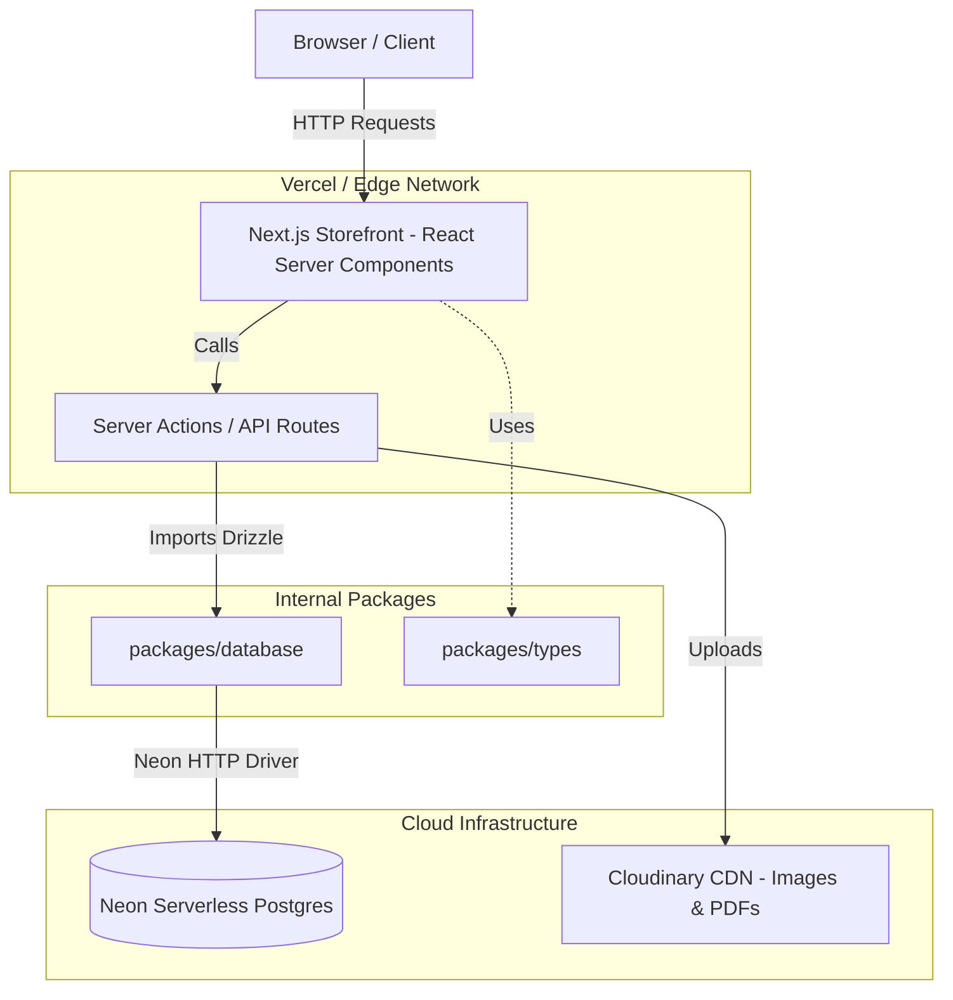

# System Architecture & Technical Decisions

This document describes the overall architecture of the **Hyundai E-Commerce B2B** project, key technology choices (ADRs), and core data flows.

---

## 1. High-Level Architecture

The project follows a **Serverless Monolith** pattern built with Next.js App Router, combined with a monorepo structure to maximize code sharing and type safety.

---

## 2. Monorepo Structure

The project uses **Turborepo** + **Bun** as the monorepo manager. The separation between `apps/` and `packages/` follows the Separation of Concerns principle.

- 📂 **`apps/storefront`**: Main customer-facing application (Next.js 16 App Router). Contains UI, i18n, Zustand state, and Server Actions.
- 📂 **`apps/admin-panel`** (planned): Admin dashboard for inventory and quote management.
- 📂 **`packages/database`**: **Single Source of Truth** for the data layer. Contains all Drizzle ORM schemas and PostgreSQL table definitions.
- 📂 **`packages/types`**: Shared TypeScript interfaces and Zod schemas used by both frontend and backend to ensure 100% end-to-end type safety.

---

## 3. Architecture Decision Records (ADR)

### 3.1. Database: Neon Serverless Postgres (instead of traditional RDS)

- **Problem**: In a Serverless environment (Vercel), frequent cold starts with traditional TCP connections quickly exhaust the database connection pool (`too many connections` error).
- **Decision**: Use Neon Postgres with its HTTP driver.
- **Benefits**: True zero-scale when idle (cost saving), and HTTP connections bypass connection pool limitations on the Edge network.

### 3.2. ORM: Drizzle ORM (instead of Prisma)

- **Problem**: Prisma’s Rust Query Engine is heavy (tens of MB), increases bundle size, and slows down cold starts. JSONB deep querying is also limited.
- **Decision**: Adopt Drizzle ORM.
- **Benefits**: Extremely lightweight, zero runtime dependencies, and 1:1 mapping with raw SQL. Gives full control over complex queries, especially with the `specs` JSONB column.

### 3.3. State Management: Zustand (instead of Redux)

- **Decision**: Use Zustand for client-side global state (e.g., shopping cart).
- **Benefits**: Minimal boilerplate, no need for a `<Provider>` wrapper (compatible with React Server Components), and easy integration with persist middleware for localStorage.

---

## 4. Key Workflows

### Bidding / Quote Negotiation System

To maintain financial data integrity, the `shipping_fee` column in the main `orders` table is never updated directly multiple times. Instead, all shipping quotes from third-party carriers are first stored in the `shipping_bids` table. Only when the Admin clicks **"Finalize Price"** does the system run a **SQL transaction** to copy the final value into the main `orders` table and lock the flow.
