# Database Schema

**Generated automatically** from Drizzle schema on 2026-05-01

---

## Entity Relationship Diagram (ERD)

```mermaid
erDiagram
    accounts ||--o{ user : "user_id"
    cartItems ||--o{ cart : "cartId"
    cartItems ||--o{ product : "productId"
    carts ||--o{ user : "userId"
    categories ||--o{ category : "parentId"
    orderItems ||--o{ order : "orderId"
    orderItems ||--o{ product : "productId"
    orders ||--o{ user : "userId"
    payments ||--o{ order : "orderId"
    products ||--o{ brand : "brandId"
    products ||--o{ category : "categoryId"
    sessions ||--o{ user : "user_id"
    shippingBids ||--o{ order : "orderId"
    userAddresses ||--o{ user : "userId"
    users ||--o{ dealer_tier : "dealerTierId"
    warehouseStocks ||--o{ warehouse : "warehouseId"
    warehouseStocks ||--o{ product : "productId"

    accounts {
        text id PK
        uuid user_id FK
        text account_id
        text provider_id
        text access_token
        text refresh_token
    }
    brands {
        uuid id PK
        timestamptz createdAt
        timestamptz updatedAt
        text name
        text slug
    }
    cartItems {
        uuid id PK
        uuid cartId FK
        uuid productId FK
        timestamptz createdAt
        timestamptz updatedAt
        int quantity
    }
    carts {
        uuid id PK
        uuid userId FK
        timestamptz createdAt
        timestamptz updatedAt
    }
    categories {
        uuid id PK
        uuid parentId FK
        timestamptz createdAt
        timestamptz updatedAt
        text name
        text slug
    }
    dealerTiers {
        uuid id PK
        timestamptz createdAt
        timestamptz updatedAt
        text name
        numeric discountPercentage
    }
    orderItems {
        uuid id PK
        uuid orderId FK
        uuid productId FK
        timestamptz createdAt
        timestamptz updatedAt
        text productName
        text productSku
    }
    orders {
        uuid id PK
        uuid userId FK
        timestamptz createdAt
        timestamptz updatedAt
        enum status
        numeric shippingFee
    }
    outboxEvents {
        uuid id PK
        timestamptz createdAt
        timestamptz updatedAt
        enum eventType
        jsonb payload
    }
    payments {
        uuid id PK
        uuid orderId FK
        timestamptz createdAt
        timestamptz updatedAt
        timestamptz deletedAt
        numeric amount
    }
    products {
        uuid id PK
        uuid brandId FK
        uuid categoryId FK
        timestamptz createdAt
        timestamptz updatedAt
        timestamptz deletedAt
        text name
    }
    sessions {
        text id PK
        uuid user_id FK
        timestamptz expires_at
        text token
        timestamptz created_at
        timestamptz updated_at
    }
    shippingBids {
        uuid id PK
        uuid orderId FK
        timestamptz createdAt
        timestamptz updatedAt
        text vendorName
        numeric quotedPrice
    }
    userAddresses {
        uuid id PK
        uuid userId FK
        timestamptz createdAt
        timestamptz updatedAt
        timestamptz deletedAt
        text receiverName
    }
    users {
        uuid id PK
        uuid dealerTierId FK
        timestamptz createdAt
        timestamptz updatedAt
        timestamptz deletedAt
        text name
    }
    verifications {
        text id PK
        text identifier
        text value
        timestamptz expires_at
        timestamptz created_at
    }
    warehouseStocks {
        uuid warehouseId FK
        uuid productId FK
        int stock
        int minStockWarning
        timestamptz createdAt
        timestamptz updatedAt
    }
    warehouses {
        uuid id PK
        timestamptz createdAt
        timestamptz updatedAt
        text name
        text streetAddress
    }

```

---

## Tables Overview

- [accounts](#accounts)
- [brands](#brands)
- [cartItems](#cartitems)
- [carts](#carts)
- [categories](#categories)
- [dealerTiers](#dealertiers)
- [orderItems](#orderitems)
- [orders](#orders)
- [outboxEvents](#outboxevents)
- [payments](#payments)
- [products](#products)
- [sessions](#sessions)
- [shippingBids](#shippingbids)
- [userAddresses](#useraddresses)
- [users](#users)
- [verifications](#verifications)
- [warehouseStocks](#warehousestocks)
- [warehouses](#warehouses)

---

## accounts

### Columns

| Column | Type | Nullable | Default | Primary |
|--------|------|----------|---------|---------|
| id | text | NO | - | YES |
| account_id | text | NO | - | - |
| provider_id | text | NO | - | - |
| user_id | uuid | NO | - | - |
| access_token | text | YES | - | - |
| refresh_token | text | YES | - | - |
| id_token | text | YES | - | - |
| access_token_expires_at | timestamptz | YES | - | - |
| refresh_token_expires_at | timestamptz | YES | - | - |
| scope | text | YES | - | - |
| password | text | YES | - | - |
| created_at | timestamptz | NO | SQL: now() | - |
| updated_at | timestamptz | NO | Auto-update | - |

### Foreign Keys

- `user_id` → `user.id` (ON DELETE cascade)

### Indexes

- `account_user_id_idx`: (user_id)

---

## brands

### Columns

| Column | Type | Nullable | Default | Primary |
|--------|------|----------|---------|---------|
| id | uuid | NO | Dynamic Fn | YES |
| createdAt | timestamptz | NO | SQL: now() | - |
| updatedAt | timestamptz | NO | Auto-update | - |
| name | text | NO | - | - |
| slug | text | NO | - | - |
| logo | text | YES | - | - |
| description | text | YES | - | - |
| isActive | bool | NO | true | - |

---

## cartItems

### Columns

| Column | Type | Nullable | Default | Primary |
|--------|------|----------|---------|---------|
| id | uuid | NO | Dynamic Fn | YES |
| createdAt | timestamptz | NO | SQL: now() | - |
| updatedAt | timestamptz | NO | Auto-update | - |
| cartId | uuid | NO | - | - |
| productId | uuid | NO | - | - |
| quantity | int | NO | 1 | - |

### Foreign Keys

- `cartId` → `cart.id` (ON DELETE cascade)
- `productId` → `product.id` (ON DELETE cascade)

### Indexes

- `cart_product_unique_idx`: (cartId, productId)

---

## carts

### Columns

| Column | Type | Nullable | Default | Primary |
|--------|------|----------|---------|---------|
| id | uuid | NO | Dynamic Fn | YES |
| createdAt | timestamptz | NO | SQL: now() | - |
| updatedAt | timestamptz | NO | Auto-update | - |
| userId | uuid | YES | - | - |

### Foreign Keys

- `userId` → `user.id` (ON DELETE cascade)

---

## categories

### Columns

| Column | Type | Nullable | Default | Primary |
|--------|------|----------|---------|---------|
| id | uuid | NO | Dynamic Fn | YES |
| createdAt | timestamptz | NO | SQL: now() | - |
| updatedAt | timestamptz | NO | Auto-update | - |
| name | text | NO | - | - |
| slug | text | NO | - | - |
| parentId | uuid | YES | - | - |
| description | text | YES | - | - |
| image | text | YES | - | - |
| isActive | bool | NO | true | - |

### Foreign Keys

- `parentId` → `category.id` (ON DELETE set null)

---

## dealerTiers

### Columns

| Column | Type | Nullable | Default | Primary |
|--------|------|----------|---------|---------|
| id | uuid | NO | Dynamic Fn | YES |
| createdAt | timestamptz | NO | SQL: now() | - |
| updatedAt | timestamptz | NO | Auto-update | - |
| name | text | NO | - | - |
| discountPercentage | numeric | NO | - | - |
| minimumSpend | numeric | NO | 0 | - |

---

## orderItems

### Columns

| Column | Type | Nullable | Default | Primary |
|--------|------|----------|---------|---------|
| id | uuid | NO | Dynamic Fn | YES |
| createdAt | timestamptz | NO | SQL: now() | - |
| updatedAt | timestamptz | NO | Auto-update | - |
| orderId | uuid | NO | - | - |
| productId | uuid | NO | - | - |
| productName | text | NO | - | - |
| productSku | text | NO | - | - |
| quantity | int | NO | 0 | - |
| unitPrice | numeric | NO | - | - |

### Foreign Keys

- `orderId` → `order.id` (ON DELETE cascade)
- `productId` → `product.id` (ON DELETE restrict)

---

## orders

### Columns

| Column | Type | Nullable | Default | Primary |
|--------|------|----------|---------|---------|
| id | uuid | NO | Dynamic Fn | YES |
| createdAt | timestamptz | NO | SQL: now() | - |
| updatedAt | timestamptz | NO | Auto-update | - |
| userId | uuid | NO | - | - |
| status | enum | NO | pending | - |
| shippingFee | numeric | NO | - | - |
| shippingAddress | text | NO | - | - |
| totalAmount | numeric | NO | - | - |

### Foreign Keys

- `userId` → `user.id` (ON DELETE restrict)

---

## outboxEvents

### Columns

| Column | Type | Nullable | Default | Primary |
|--------|------|----------|---------|---------|
| id | uuid | NO | Dynamic Fn | YES |
| createdAt | timestamptz | NO | SQL: now() | - |
| updatedAt | timestamptz | NO | Auto-update | - |
| eventType | enum | NO | - | - |
| payload | jsonb | NO | - | - |
| status | enum | NO | PENDING | - |
| retryCount | int | NO | 0 | - |
| lastError | text | YES | - | - |
| processedAt | timestamptz | YES | - | - |

---

## payments

### Columns

| Column | Type | Nullable | Default | Primary |
|--------|------|----------|---------|---------|
| id | uuid | NO | Dynamic Fn | YES |
| createdAt | timestamptz | NO | SQL: now() | - |
| updatedAt | timestamptz | NO | Auto-update | - |
| deletedAt | timestamptz | YES | - | - |
| orderId | uuid | NO | - | - |
| amount | numeric | NO | - | - |
| method | enum | NO | - | - |
| status | enum | NO | PENDING | - |
| transactionId | text | YES | - | - |
| rawPayload | text | YES | - | - |

### Foreign Keys

- `orderId` → `order.id` (ON DELETE restrict)

---

## products

### Columns

| Column | Type | Nullable | Default | Primary |
|--------|------|----------|---------|---------|
| id | uuid | NO | Dynamic Fn | YES |
| createdAt | timestamptz | NO | SQL: now() | - |
| updatedAt | timestamptz | NO | Auto-update | - |
| deletedAt | timestamptz | YES | - | - |
| name | text | NO | - | - |
| slug | text | NO | - | - |
| price | numeric | NO | - | - |
| description | text | YES | - | - |
| shortDescription | text | YES | - | - |
| images | text | NO | Complex Object | - |
| brandId | uuid | YES | - | - |
| categoryId | uuid | YES | - | - |
| specs | jsonb | YES | Complex Object | - |
| totalStockCache | int | NO | 0 | - |
| isQuoteOnly | bool | NO | false | - |

### Foreign Keys

- `brandId` → `brand.id` (ON DELETE set null)
- `categoryId` → `category.id` (ON DELETE set null)

### Indexes

- `product_slug_active_idx`: (slug)
- `product_name_active_idx`: (name)
- `product_brand_idx`: (brandId)
- `product_category_idx`: (categoryId)

---

## sessions

### Columns

| Column | Type | Nullable | Default | Primary |
|--------|------|----------|---------|---------|
| id | text | NO | - | YES |
| expires_at | timestamptz | NO | - | - |
| token | text | NO | - | - |
| created_at | timestamptz | NO | SQL: now() | - |
| updated_at | timestamptz | NO | Auto-update | - |
| ip_address | text | YES | - | - |
| user_agent | text | YES | - | - |
| user_id | uuid | NO | - | - |

### Foreign Keys

- `user_id` → `user.id` (ON DELETE cascade)

### Indexes

- `session_user_id_idx`: (user_id)

---

## shippingBids

### Columns

| Column | Type | Nullable | Default | Primary |
|--------|------|----------|---------|---------|
| id | uuid | NO | Dynamic Fn | YES |
| createdAt | timestamptz | NO | SQL: now() | - |
| updatedAt | timestamptz | NO | Auto-update | - |
| orderId | uuid | NO | - | - |
| vendorName | text | NO | - | - |
| quotedPrice | numeric | NO | - | - |
| internalNote | text | YES | - | - |
| isSelected | bool | YES | false | - |

### Foreign Keys

- `orderId` → `order.id` (ON DELETE cascade)

### Indexes

- `one_selected_bid_order_idx`: (orderId)

---

## userAddresses

### Columns

| Column | Type | Nullable | Default | Primary |
|--------|------|----------|---------|---------|
| id | uuid | NO | Dynamic Fn | YES |
| createdAt | timestamptz | NO | SQL: now() | - |
| updatedAt | timestamptz | NO | Auto-update | - |
| deletedAt | timestamptz | YES | - | - |
| userId | uuid | NO | - | - |
| receiverName | text | NO | - | - |
| phoneNumber | text | NO | - | - |
| streetAddress | text | NO | - | - |
| district | text | NO | - | - |
| city | text | NO | - | - |
| isDefault | bool | NO | false | - |

### Foreign Keys

- `userId` → `user.id` (ON DELETE cascade)

---

## users

### Columns

| Column | Type | Nullable | Default | Primary |
|--------|------|----------|---------|---------|
| id | uuid | NO | Dynamic Fn | YES |
| createdAt | timestamptz | NO | SQL: now() | - |
| updatedAt | timestamptz | NO | Auto-update | - |
| deletedAt | timestamptz | YES | - | - |
| name | text | NO | - | - |
| email | text | NO | - | - |
| emailVerified | bool | NO | false | - |
| image | text | YES | - | - |
| role | enum | NO | customer | - |
| dealerTierId | uuid | YES | - | - |

### Foreign Keys

- `dealerTierId` → `dealer_tier.id` (ON DELETE set null)

---

## verifications

### Columns

| Column | Type | Nullable | Default | Primary |
|--------|------|----------|---------|---------|
| id | text | NO | - | YES |
| identifier | text | NO | - | - |
| value | text | NO | - | - |
| expires_at | timestamptz | NO | - | - |
| created_at | timestamptz | NO | SQL: now() | - |
| updated_at | timestamptz | NO | Auto-update | - |

### Indexes

- `verification_identifier_idx`: (identifier)

---

## warehouseStocks

### Columns

| Column | Type | Nullable | Default | Primary |
|--------|------|----------|---------|---------|
| warehouseId | uuid | NO | - | - |
| productId | uuid | NO | - | - |
| stock | int | NO | 0 | - |
| minStockWarning | int | NO | 2 | - |
| createdAt | timestamptz | NO | SQL: now() | - |
| updatedAt | timestamptz | NO | Auto-update | - |

### Foreign Keys

- `warehouseId` → `warehouse.id` (ON DELETE cascade)
- `productId` → `product.id` (ON DELETE cascade)

---

## warehouses

### Columns

| Column | Type | Nullable | Default | Primary |
|--------|------|----------|---------|---------|
| id | uuid | NO | Dynamic Fn | YES |
| createdAt | timestamptz | NO | SQL: now() | - |
| updatedAt | timestamptz | NO | Auto-update | - |
| name | text | NO | - | - |
| streetAddress | text | NO | - | - |
| district | text | NO | - | - |
| city | text | NO | - | - |
| isActive | bool | NO | true | - |

### Indexes

- `warehouse_name_idx`: (name)

---

