# Database Schema

**Generated automatically** from Drizzle schema on 2026-06-18

---

## Entity Relationship Diagram (ERD)

```mermaid
erDiagram
    accounts ||--o{ user : "user_id"
    cartItems ||--o{ cart : "cart_id"
    cartItems ||--o{ product : "product_id"
    carts ||--o{ user : "user_id"
    categories ||--o{ category : "parent_id"
    creditLimitHistory ||--o{ user : "user_id"
    creditLimitHistory ||--o{ user : "changed_by"
    debtRepayments ||--o{ user : "user_id"
    debtRepayments ||--o{ user : "verified_by"
    orderItems ||--o{ order : "order_id"
    orderItems ||--o{ product : "product_id"
    orders ||--o{ user : "user_id"
    paymentTransactions ||--o{ order : "order_id"
    paymentTransactions ||--o{ user : "verified_by"
    payments ||--o{ order : "order_id"
    products ||--o{ brand : "brand_id"
    products ||--o{ category : "category_id"
    quoteItems ||--o{ quote : "quote_id"
    quoteItems ||--o{ product : "product_id"
    quoteMessages ||--o{ quote : "quote_id"
    quoteMessages ||--o{ user : "sender_id"
    quotes ||--o{ user : "user_id"
    quotes ||--o{ order : "order_id"
    sessions ||--o{ user : "user_id"
    shippingBids ||--o{ order : "order_id"
    userAddresses ||--o{ user : "user_id"
    users ||--o{ dealer_tier : "dealer_tier_id"
    warehouseStocks ||--o{ warehouse : "warehouse_id"
    warehouseStocks ||--o{ product : "product_id"

    accounts {
        text id PK
        uuid user_id FK
        text account_id
        text provider_id
        text access_token
        text refresh_token
    }
    brands {
        uuid id PK
        timestamptz created_at
        timestamptz updated_at
        text name
        text slug
    }
    cartItems {
        uuid id PK
        uuid cart_id FK
        uuid product_id FK
        timestamptz created_at
        timestamptz updated_at
        int quantity
    }
    carts {
        uuid id PK
        uuid user_id FK
        timestamptz created_at
        timestamptz updated_at
    }
    categories {
        uuid id PK
        uuid parent_id FK
        timestamptz created_at
        timestamptz updated_at
        text name_vi
        text name_en
    }
    creditLimitHistory {
        uuid id PK
        uuid user_id FK
        uuid changed_by FK
        timestamptz created_at
        timestamptz updated_at
        timestamptz deleted_at
        numeric old_limit
    }
    dealerTiers {
        uuid id PK
        timestamptz created_at
        timestamptz updated_at
        text name_vi
        text name_en
    }
    debtRepayments {
        uuid id PK
        uuid user_id FK
        uuid verified_by FK
        timestamptz created_at
        timestamptz updated_at
        timestamptz deleted_at
        numeric amount
    }
    orderItems {
        uuid id PK
        uuid order_id FK
        uuid product_id FK
        timestamptz created_at
        timestamptz updated_at
        text product_name
        text product_sku
    }
    orders {
        uuid id PK
        uuid user_id FK
        timestamptz created_at
        timestamptz updated_at
        enum status
        numeric shipping_fee
    }
    outboxEvents {
        uuid id PK
        timestamptz created_at
        timestamptz updated_at
        enum event_type
        jsonb payload
    }
    paymentTransactions {
        uuid id PK
        uuid order_id FK
        uuid verified_by FK
        timestamptz created_at
        timestamptz updated_at
        timestamptz deleted_at
        numeric amount
    }
    payments {
        uuid id PK
        uuid order_id FK
        timestamptz created_at
        timestamptz updated_at
        timestamptz deleted_at
        numeric amount
    }
    products {
        uuid id PK
        uuid brand_id FK
        uuid category_id FK
        timestamptz created_at
        timestamptz updated_at
        timestamptz deleted_at
        text name_vi
    }
    quoteItems {
        uuid id PK
        uuid quote_id FK
        uuid product_id FK
        timestamptz created_at
        timestamptz updated_at
        int quantity
        numeric requested_price
    }
    quoteMessages {
        uuid id PK
        uuid quote_id FK
        uuid sender_id FK
        timestamptz created_at
        timestamptz updated_at
        text message
    }
    quotes {
        uuid id PK
        uuid user_id FK
        uuid order_id FK
        timestamptz created_at
        timestamptz updated_at
        enum status
        numeric total_quoted_price
    }
    sessions {
        text id PK
        uuid user_id FK
        timestamptz expires_at
        text token
        timestamptz created_at
        timestamptz updated_at
    }
    shippingBids {
        uuid id PK
        uuid order_id FK
        timestamptz created_at
        timestamptz updated_at
        text vendor_name
        numeric quoted_price
    }
    userAddresses {
        uuid id PK
        uuid user_id FK
        timestamptz created_at
        timestamptz updated_at
        text receiver_name
        text phone_number
    }
    users {
        uuid id PK
        uuid dealer_tier_id FK
        timestamptz created_at
        timestamptz updated_at
        timestamptz deleted_at
        text name
    }
    verifications {
        text id PK
        text identifier
        text value
        timestamptz expires_at
        timestamptz created_at
    }
    warehouseStocks {
        uuid warehouse_id FK
        uuid product_id FK
        int stock
        int min_stock_warning
        timestamptz created_at
        timestamptz updated_at
    }
    warehouses {
        uuid id PK
        timestamptz created_at
        timestamptz updated_at
        text name_vi
        text name_en
    }

```

---

## Tables Overview

- [accounts](#accounts)
- [brands](#brands)
- [cartItems](#cartitems)
- [carts](#carts)
- [categories](#categories)
- [creditLimitHistory](#creditlimithistory)
- [dealerTiers](#dealertiers)
- [debtRepayments](#debtrepayments)
- [orderItems](#orderitems)
- [orders](#orders)
- [outboxEvents](#outboxevents)
- [paymentTransactions](#paymenttransactions)
- [payments](#payments)
- [products](#products)
- [quoteItems](#quoteitems)
- [quoteMessages](#quotemessages)
- [quotes](#quotes)
- [sessions](#sessions)
- [shippingBids](#shippingbids)
- [userAddresses](#useraddresses)
- [users](#users)
- [verifications](#verifications)
- [warehouseStocks](#warehousestocks)
- [warehouses](#warehouses)

---

## accounts

### Columns

| Column | Type | Nullable | Default | Primary |
|--------|------|----------|---------|---------|
| id | text | NO | - | YES |
| account_id | text | NO | - | - |
| provider_id | text | NO | - | - |
| user_id | uuid | NO | - | - |
| access_token | text | YES | - | - |
| refresh_token | text | YES | - | - |
| id_token | text | YES | - | - |
| access_token_expires_at | timestamptz | YES | - | - |
| refresh_token_expires_at | timestamptz | YES | - | - |
| scope | text | YES | - | - |
| password | text | YES | - | - |
| created_at | timestamptz | NO | SQL: now() | - |
| updated_at | timestamptz | NO | Auto-update | - |

### Foreign Keys

- `user_id` → `user.id` (ON DELETE cascade)

### Indexes

- `account_user_id_idx`: (user_id)

---

## brands

### Columns

| Column | Type | Nullable | Default | Primary |
|--------|------|----------|---------|---------|
| id | uuid | NO | Dynamic Fn | YES |
| created_at | timestamptz | NO | SQL: now() | - |
| updated_at | timestamptz | NO | Auto-update | - |
| name | text | NO | - | - |
| slug | text | NO | - | - |
| logo | text | YES | - | - |
| description_vi | text | YES | - | - |
| description_en | text | YES | - | - |
| is_active | bool | NO | true | - |

---

## cartItems

### Columns

| Column | Type | Nullable | Default | Primary |
|--------|------|----------|---------|---------|
| id | uuid | NO | Dynamic Fn | YES |
| created_at | timestamptz | NO | SQL: now() | - |
| updated_at | timestamptz | NO | Auto-update | - |
| cart_id | uuid | NO | - | - |
| product_id | uuid | NO | - | - |
| quantity | int | NO | 1 | - |

### Foreign Keys

- `cart_id` → `cart.id` (ON DELETE cascade)
- `product_id` → `product.id` (ON DELETE cascade)

### Indexes

- `cart_product_unique_idx`: (cart_id, product_id)

---

## carts

### Columns

| Column | Type | Nullable | Default | Primary |
|--------|------|----------|---------|---------|
| id | uuid | NO | Dynamic Fn | YES |
| created_at | timestamptz | NO | SQL: now() | - |
| updated_at | timestamptz | NO | Auto-update | - |
| user_id | uuid | NO | - | - |

### Foreign Keys

- `user_id` → `user.id` (ON DELETE cascade)

---

## categories

### Columns

| Column | Type | Nullable | Default | Primary |
|--------|------|----------|---------|---------|
| id | uuid | NO | Dynamic Fn | YES |
| created_at | timestamptz | NO | SQL: now() | - |
| updated_at | timestamptz | NO | Auto-update | - |
| name_vi | text | NO | - | - |
| name_en | text | YES | - | - |
| slug | text | NO | - | - |
| parent_id | uuid | YES | - | - |
| description_vi | text | YES | - | - |
| description_en | text | YES | - | - |
| image | text | YES | - | - |
| is_active | bool | NO | true | - |

### Foreign Keys

- `parent_id` → `category.id` (ON DELETE set null)

---

## creditLimitHistory

### Columns

| Column | Type | Nullable | Default | Primary |
|--------|------|----------|---------|---------|
| id | uuid | NO | Dynamic Fn | YES |
| created_at | timestamptz | NO | SQL: now() | - |
| updated_at | timestamptz | NO | Auto-update | - |
| deleted_at | timestamptz | YES | - | - |
| user_id | uuid | NO | - | - |
| old_limit | numeric | NO | - | - |
| new_limit | numeric | NO | - | - |
| changed_by | uuid | NO | - | - |
| reason | text | YES | - | - |

### Foreign Keys

- `user_id` → `user.id` (ON DELETE cascade)
- `changed_by` → `user.id` (ON DELETE restrict)

---

## dealerTiers

### Columns

| Column | Type | Nullable | Default | Primary |
|--------|------|----------|---------|---------|
| id | uuid | NO | Dynamic Fn | YES |
| created_at | timestamptz | NO | SQL: now() | - |
| updated_at | timestamptz | NO | Auto-update | - |
| name_vi | text | NO | - | - |
| name_en | text | YES | - | - |
| discount_percentage | numeric | NO | - | - |
| minimum_spend | numeric | NO | 0 | - |

---

## debtRepayments

### Columns

| Column | Type | Nullable | Default | Primary |
|--------|------|----------|---------|---------|
| id | uuid | NO | Dynamic Fn | YES |
| created_at | timestamptz | NO | SQL: now() | - |
| updated_at | timestamptz | NO | Auto-update | - |
| deleted_at | timestamptz | YES | - | - |
| user_id | uuid | NO | - | - |
| amount | numeric | NO | - | - |
| payment_method | enum | NO | - | - |
| status | enum | NO | PENDING | - |
| order_code | bigint:number | YES | - | - |
| reference_code | text | YES | - | - |
| verified_by | uuid | YES | - | - |

### Foreign Keys

- `user_id` → `user.id` (ON DELETE restrict)
- `verified_by` → `user.id` (ON DELETE set null)

---

## orderItems

### Columns

| Column | Type | Nullable | Default | Primary |
|--------|------|----------|---------|---------|
| id | uuid | NO | Dynamic Fn | YES |
| created_at | timestamptz | NO | SQL: now() | - |
| updated_at | timestamptz | NO | Auto-update | - |
| order_id | uuid | NO | - | - |
| product_id | uuid | NO | - | - |
| product_name | text | NO | - | - |
| product_sku | text | NO | - | - |
| quantity | int | NO | 0 | - |
| unit_price | numeric | NO | - | - |

### Foreign Keys

- `order_id` → `order.id` (ON DELETE cascade)
- `product_id` → `product.id` (ON DELETE restrict)

### Indexes

- `order_item_order_idx`: (order_id)
- `order_item_product_idx`: (product_id)

---

## orders

### Columns

| Column | Type | Nullable | Default | Primary |
|--------|------|----------|---------|---------|
| id | uuid | NO | Dynamic Fn | YES |
| created_at | timestamptz | NO | SQL: now() | - |
| updated_at | timestamptz | NO | Auto-update | - |
| user_id | uuid | NO | - | - |
| status | enum | NO | PENDING | - |
| shipping_fee | numeric | NO | - | - |
| shipping_address | text | NO | - | - |
| total_amount | numeric | NO | - | - |
| payment_method | enum | NO | PAYOS | - |
| payment_status | enum | NO | UNPAID | - |
| approval_status | enum | NO | APPROVED | - |

### Foreign Keys

- `user_id` → `user.id` (ON DELETE restrict)

### Indexes

- `order_user_status_created_idx`: (user_id, status, created_at)
- `order_active_metrics_idx`: (created_at)

---

## outboxEvents

### Columns

| Column | Type | Nullable | Default | Primary |
|--------|------|----------|---------|---------|
| id | uuid | NO | Dynamic Fn | YES |
| created_at | timestamptz | NO | SQL: now() | - |
| updated_at | timestamptz | NO | Auto-update | - |
| event_type | enum | NO | - | - |
| payload | jsonb | NO | - | - |
| status | enum | NO | PENDING | - |
| retry_count | int | NO | 0 | - |
| last_error | text | YES | - | - |
| processed_at | timestamptz | YES | - | - |

---

## paymentTransactions

### Columns

| Column | Type | Nullable | Default | Primary |
|--------|------|----------|---------|---------|
| id | uuid | NO | Dynamic Fn | YES |
| created_at | timestamptz | NO | SQL: now() | - |
| updated_at | timestamptz | NO | Auto-update | - |
| deleted_at | timestamptz | YES | - | - |
| order_id | uuid | NO | - | - |
| amount | numeric | NO | - | - |
| payment_method | enum | NO | - | - |
| transaction_type | enum | NO | - | - |
| status | enum | NO | PENDING | - |
| order_code | bigint:number | YES | - | - |
| reference_code | text | YES | - | - |
| verified_by | uuid | YES | - | - |

### Foreign Keys

- `order_id` → `order.id` (ON DELETE cascade)
- `verified_by` → `user.id` (ON DELETE set null)

---

## payments

### Columns

| Column | Type | Nullable | Default | Primary |
|--------|------|----------|---------|---------|
| id | uuid | NO | Dynamic Fn | YES |
| created_at | timestamptz | NO | SQL: now() | - |
| updated_at | timestamptz | NO | Auto-update | - |
| deleted_at | timestamptz | YES | - | - |
| order_id | uuid | NO | - | - |
| amount | numeric | NO | - | - |
| method | enum | NO | - | - |
| status | enum | NO | PENDING | - |
| raw_payload | text | YES | - | - |

### Foreign Keys

- `order_id` → `order.id` (ON DELETE restrict)

---

## products

### Columns

| Column | Type | Nullable | Default | Primary |
|--------|------|----------|---------|---------|
| id | uuid | NO | Dynamic Fn | YES |
| created_at | timestamptz | NO | SQL: now() | - |
| updated_at | timestamptz | NO | Auto-update | - |
| deleted_at | timestamptz | YES | - | - |
| name_vi | text | NO | - | - |
| name_en | text | YES | - | - |
| slug | text | NO | - | - |
| price | numeric | NO | - | - |
| description_vi | jsonb | YES | - | - |
| description_en | jsonb | YES | - | - |
| short_description_vi | text | YES | - | - |
| short_description_en | text | YES | - | - |
| images | text | NO | Complex Object | - |
| brand_id | uuid | YES | - | - |
| category_id | uuid | YES | - | - |
| specs | jsonb | YES | Complex Object | - |
| total_stock_cache | int | NO | 0 | - |
| total_sales_cache | int | NO | 0 | - |
| is_quote_only | bool | NO | false | - |

### Foreign Keys

- `brand_id` → `brand.id` (ON DELETE set null)
- `category_id` → `category.id` (ON DELETE set null)

### Indexes

- `product_slug_active_idx`: (slug)
- `product_name_active_idx`: (name_vi)
- `product_brand_idx`: (brand_id)
- `product_category_idx`: (category_id)
- `product_sales_cache_idx`: (total_sales_cache)
- `product_created_at_idx`: (created_at)
- `product_power_idx`: (unknown)
- `product_voltage_idx`: (unknown)

---

## quoteItems

### Columns

| Column | Type | Nullable | Default | Primary |
|--------|------|----------|---------|---------|
| id | uuid | NO | Dynamic Fn | YES |
| created_at | timestamptz | NO | SQL: now() | - |
| updated_at | timestamptz | NO | Auto-update | - |
| quote_id | uuid | NO | - | - |
| product_id | uuid | NO | - | - |
| quantity | int | NO | 1 | - |
| requested_price | numeric | NO | - | - |
| agreed_price | numeric | YES | - | - |

### Foreign Keys

- `quote_id` → `quote.id` (ON DELETE cascade)
- `product_id` → `product.id` (ON DELETE restrict)

### Indexes

- `quote_item_quote_idx`: (quote_id)
- `quote_item_product_idx`: (product_id)

---

## quoteMessages

### Columns

| Column | Type | Nullable | Default | Primary |
|--------|------|----------|---------|---------|
| id | uuid | NO | Dynamic Fn | YES |
| created_at | timestamptz | NO | SQL: now() | - |
| updated_at | timestamptz | NO | Auto-update | - |
| quote_id | uuid | NO | - | - |
| sender_id | uuid | NO | - | - |
| message | text | NO | - | - |

### Foreign Keys

- `quote_id` → `quote.id` (ON DELETE cascade)
- `sender_id` → `user.id` (ON DELETE restrict)

### Indexes

- `quote_message_quote_idx`: (quote_id)
- `quote_message_sender_idx`: (sender_id)

---

## quotes

### Columns

| Column | Type | Nullable | Default | Primary |
|--------|------|----------|---------|---------|
| id | uuid | NO | Dynamic Fn | YES |
| created_at | timestamptz | NO | SQL: now() | - |
| updated_at | timestamptz | NO | Auto-update | - |
| user_id | uuid | NO | - | - |
| status | enum | NO | pending_review | - |
| total_quoted_price | numeric | YES | - | - |
| expiration_date | timestamptz | YES | - | - |
| note | text | YES | - | - |
| order_id | uuid | YES | - | - |

### Foreign Keys

- `user_id` → `user.id` (ON DELETE restrict)
- `order_id` → `order.id` (ON DELETE set null)

### Indexes

- `quote_user_idx`: (user_id)
- `quote_order_idx`: (order_id)
- `quote_created_at_idx`: (created_at)

---

## sessions

### Columns

| Column | Type | Nullable | Default | Primary |
|--------|------|----------|---------|---------|
| id | text | NO | - | YES |
| expires_at | timestamptz | NO | - | - |
| token | text | NO | - | - |
| created_at | timestamptz | NO | SQL: now() | - |
| updated_at | timestamptz | NO | Auto-update | - |
| ip_address | text | YES | - | - |
| user_agent | text | YES | - | - |
| user_id | uuid | NO | - | - |

### Foreign Keys

- `user_id` → `user.id` (ON DELETE cascade)

### Indexes

- `session_user_id_idx`: (user_id)

---

## shippingBids

### Columns

| Column | Type | Nullable | Default | Primary |
|--------|------|----------|---------|---------|
| id | uuid | NO | Dynamic Fn | YES |
| created_at | timestamptz | NO | SQL: now() | - |
| updated_at | timestamptz | NO | Auto-update | - |
| order_id | uuid | NO | - | - |
| vendor_name | text | NO | - | - |
| quoted_price | numeric | NO | - | - |
| internal_note | text | YES | - | - |
| is_selected | bool | YES | false | - |

### Foreign Keys

- `order_id` → `order.id` (ON DELETE cascade)

### Indexes

- `one_selected_bid_order_idx`: (order_id)

---

## userAddresses

### Columns

| Column | Type | Nullable | Default | Primary |
|--------|------|----------|---------|---------|
| id | uuid | NO | Dynamic Fn | YES |
| created_at | timestamptz | NO | SQL: now() | - |
| updated_at | timestamptz | NO | Auto-update | - |
| user_id | uuid | NO | - | - |
| receiver_name | text | NO | - | - |
| phone_number | text | NO | - | - |
| street_address | text | NO | - | - |
| district | text | NO | - | - |
| city | text | NO | - | - |
| is_default | bool | NO | false | - |

### Foreign Keys

- `user_id` → `user.id` (ON DELETE cascade)

---

## users

### Columns

| Column | Type | Nullable | Default | Primary |
|--------|------|----------|---------|---------|
| id | uuid | NO | Dynamic Fn | YES |
| created_at | timestamptz | NO | SQL: now() | - |
| updated_at | timestamptz | NO | Auto-update | - |
| deleted_at | timestamptz | YES | - | - |
| name | text | NO | - | - |
| email | text | NO | - | - |
| email_verified | bool | NO | false | - |
| image | text | YES | - | - |
| role | enum | NO | CUSTOMER | - |
| dealer_tier_id | uuid | YES | - | - |
| phone | text | NO | - | - |
| company_name | text | YES | - | - |
| tax_id | text | YES | - | - |
| business_type | enum | NO | END_USER | - |
| province | text | YES | - | - |
| credit_limit | numeric | NO | 0.00 | - |
| current_debt | numeric | NO | 0.00 | - |

### Foreign Keys

- `dealer_tier_id` → `dealer_tier.id` (ON DELETE set null)

### Indexes

- `user_dealer_tier_idx`: (dealer_tier_id)
- `user_created_at_idx`: (created_at)

---

## verifications

### Columns

| Column | Type | Nullable | Default | Primary |
|--------|------|----------|---------|---------|
| id | text | NO | - | YES |
| identifier | text | NO | - | - |
| value | text | NO | - | - |
| expires_at | timestamptz | NO | - | - |
| created_at | timestamptz | NO | SQL: now() | - |
| updated_at | timestamptz | NO | Auto-update | - |

### Indexes

- `verification_identifier_idx`: (identifier)

---

## warehouseStocks

### Columns

| Column | Type | Nullable | Default | Primary |
|--------|------|----------|---------|---------|
| warehouse_id | uuid | NO | - | - |
| product_id | uuid | NO | - | - |
| stock | int | NO | 0 | - |
| min_stock_warning | int | NO | 2 | - |
| created_at | timestamptz | NO | SQL: now() | - |
| updated_at | timestamptz | NO | Auto-update | - |

### Foreign Keys

- `warehouse_id` → `warehouse.id` (ON DELETE cascade)
- `product_id` → `product.id` (ON DELETE cascade)

### Indexes

- `warehouse_stock_product_idx`: (product_id)

---

## warehouses

### Columns

| Column | Type | Nullable | Default | Primary |
|--------|------|----------|---------|---------|
| id | uuid | NO | Dynamic Fn | YES |
| created_at | timestamptz | NO | SQL: now() | - |
| updated_at | timestamptz | NO | Auto-update | - |
| name_vi | text | NO | - | - |
| name_en | text | YES | - | - |
| street_address | text | NO | - | - |
| district | text | NO | - | - |
| city | text | NO | - | - |
| is_active | bool | NO | true | - |

### Indexes

- `warehouse_name_idx`: (name_vi)

---

