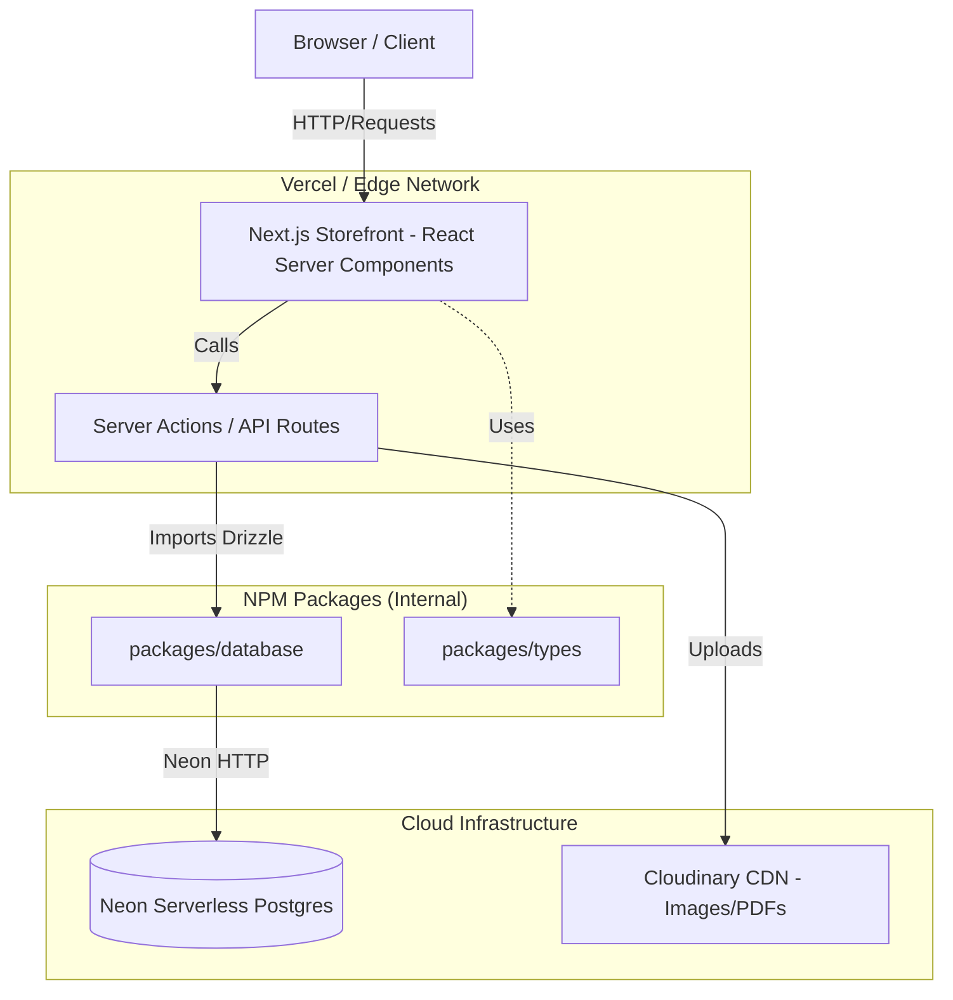

# ⚙️ System Architecture & Technical Decisions

Tài liệu này mô tả kiến trúc tổng thể của dự án **Hyundai E-Commerce B2B**, các quyết định lựa chọn công nghệ (ADR) và luồng dữ liệu cốt lõi.

---

## 1. High-Level Architecture (Sơ đồ hệ thống)

Dự án áp dụng mô hình **Serverless Monolith** (với Next.js App Router) kết hợp cùng quản lý đa gói (Monorepo) để tối ưu hóa việc chia sẻ Logic và Type.

---

## 2. Monorepo Topology (Cấu trúc Source Code)

Hệ thống sử dụng **Turborepo** + **Bun** để quản lý Workspace. Việc tách biệt `apps/` và `packages/` tuân thủ nguyên lý Separation of Concerns (Tách biệt mối quan tâm).

- 📂 `apps/storefront`: Frontend Client facing (Next.js 16). Chứa UI, i18n, Zustand state và Server Actions.

- 📂 `apps/admin-panel`: (Dự kiến) SPA cho Admin quản lý kho và báo giá.

- 📂 `packages/database`: Nguồn chân lý duy nhất (Single Source of Truth) cho Data Schema. Chứa cấu hình Drizzle ORM và định nghĩa Postgres Tables.

- 📂 `packages/types`: Nơi chứa chung các TypeScript Interfaces, Zod Validation Schemas để cả FE và BE cùng xài, đảm bảo Type-safe 100% từ đầu đến cuối.

---

## 3. Architecture Decision Records (ADR - Quyết định Kỹ thuật)

Đây là những lý do cốt lõi đằng sau Tech Stack của dự án:

### 3.1. Database: Neon Postgres (Serverless) thay vì Traditional RDS

- **Vấn đề:** Môi trường Serverless (Vercel) thường xuyên tạo ra các "Cold Start", nếu dùng TCP Connection truyền thống sẽ dẫn đến cạn kiệt Connection Pool (Lỗi `too many connections`).

- **Quyết định:** Sử dụng Neon Postgres với driver HTTP.

- **Lợi ích:** Scale về 0 khi không có traffic giúp tiết kiệm chi phí, kết nối HTTP giúp vượt qua rào cản Connection Pool trên Edge Network.

### 3.2. ORM: Drizzle ORM thay vì Prisma

- **Vấn đề:** Prisma mang theo Rust Query Engine rất nặng (hàng chục MB), làm tăng dung lượng bundle và làm chậm Cold Start trên Edge. Hơn nữa, truy vấn các cột JSONB sâu bằng Prisma rất hạn chế.

- **Quyết định:** Dùng Drizzle ORM.

- **Lợi ích:** Zero-dependency, dung lượng cực nhẹ. Cú pháp Map 1:1 với SQL thuần giúp Admin kiểm soát hoàn toàn các câu lệnh phức tạp (đặc biệt là cột `specs` dạng JSONB của máy phát điện).

### 3.3. State Management: Zustand (thay vì Redux)

- **Quyết định:** Sử dụng Zustand cho Global State ở Client (như Giỏ hàng - Cart).

- **Lợi ích:** Boilerplate cực ít, không cần bọc `<Provider>` quanh root app (tránh ảnh hưởng tới React Server Components), dễ dàng setup Persist Middleware để lưu giỏ hàng vào `localStorage`.

---

## 4. Key Workflows (Luồng xử lý cốt lõi)

### Bidding System (Hệ thống lưu vết Báo giá)

Để tránh vi phạm toàn vẹn dữ liệu tài chính, cột `shipping_fee` trong bảng `orders` gốc sẽ không bị thay đổi liên tục. Thay vào đó, mọi phương án báo giá từ nhà xe bên thứ 3 được Admin "nháp" vào bảng phụ `shipping_bids`. Chỉ khi Admin bấm "Chốt", hệ thống mới chạy **SQL Transaction** để chép con số cuối cùng vào bảng `orders` gốc và khóa luồng.
