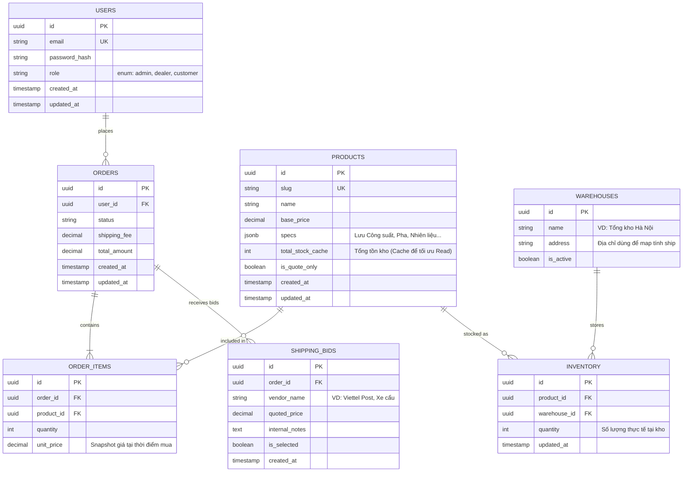

# 🗄️ Database Schema & ERD

Dự án sử dụng **PostgreSQL (Neon Serverless)** làm hệ quản trị CSDL, giao tiếp thông qua **Drizzle ORM**. Thiết kế dưới đây tập trung vào luồng nghiệp vụ B2B lõi, giải quyết bài toán Đa kho (Multi-warehouse) và quản lý thông số kỹ thuật phức tạp của thiết bị công nghiệp.

---

## 1. Entity Relationship Diagram (ERD)

---

## 2. Các Quyết định Thiết kế Lõi (Key Design Decisions)

### 2.1. Phép màu JSONB cho Thông số kỹ thuật (EAV Alternative)

Thay vì sử dụng mô hình EAV (Entity-Attribute-Value) cồng kềnh với hàng chục bảng trung gian để lưu các thuộc tính động của máy phát điện (Công suất, Độ ồn, Số pha), hệ thống sử dụng cột `specs` dạng `JSONB`. Điều này giúp:

- Giảm số lượng phép `JOIN` khi truy vấn.
- Tận dụng sức mạnh Index của PostgreSQL trên JSONB để query siêu tốc.

### 2.2. Giải quyết bài toán Đa kho (Multi-Warehouse Inventory)

Tuyệt đối không hardcode các cột như `stock_hn` hay `stock_hcm`. Hệ thống tách biệt thành bảng `WAREHOUSES` và bảng trung gian `INVENTORY`. Cột `total_stock_cache` trong bảng `PRODUCTS` được sử dụng như một Denormalized Field để giảm tải cho DB khi User cuộn trang danh sách sản phẩm.

### 2.3. Bidding System (Hệ thống đàm phán vận chuyển)

Đối với hàng siêu trọng, phí ship thay đổi theo từng đơn. Bảng `SHIPPING_BIDS` đóng vai trò là một "Shadow Entity" (Sổ nháp) để Admin ghi nhận báo giá từ nhiều nhà xe. Chỉ khi Admin bấm chọn 1 Bid, Database Transaction mới được kích hoạt để copy `quoted_price` sang cột `shipping_fee` của bảng `ORDERS` gốc, đảm bảo tính toàn vẹn dữ liệu tài chính.
