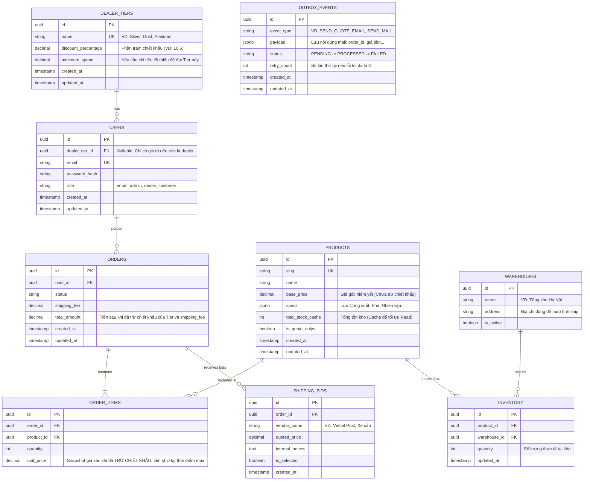

# 🗄️ Database Schema & ERD

Dự án sử dụng **PostgreSQL (Neon Serverless)** làm hệ quản trị CSDL, giao tiếp thông qua **Drizzle ORM**. Thiết kế dưới đây tập trung vào luồng nghiệp vụ B2B lõi, giải quyết bài toán Đa kho (Multi-warehouse) và quản lý thông số kỹ thuật phức tạp của thiết bị công nghiệp.

---

## 1. Entity Relationship Diagram (ERD)

---

## 2. Các Quyết định Thiết kế Lõi (Key Design Decisions)

### 2.1. Phép màu JSONB cho Thông số kỹ thuật (EAV Alternative)

Thay vì sử dụng mô hình EAV (Entity-Attribute-Value) cồng kềnh với hàng chục bảng trung gian để lưu các thuộc tính động của máy phát điện (Công suất, Độ ồn, Số pha), hệ thống sử dụng cột `specs` dạng `JSONB`. Điều này giúp:

- Giảm số lượng phép `JOIN` khi truy vấn.
- Tận dụng sức mạnh Index của PostgreSQL trên JSONB để query siêu tốc.

### 2.2. Giải quyết bài toán Đa kho (Multi-Warehouse Inventory)

Tuyệt đối không hardcode các cột như `stock_hn` hay `stock_hcm`. Hệ thống tách biệt thành bảng `WAREHOUSES` và bảng trung gian `INVENTORY`. Cột `total_stock_cache` trong bảng `PRODUCTS` được sử dụng như một Denormalized Field để giảm tải cho DB khi User cuộn trang danh sách sản phẩm.

### 2.3. Bidding System (Hệ thống đàm phán vận chuyển)

Phí ship hàng công nghiệp thay đổi theo từng đơn. Bảng `SHIPPING_BIDS` đóng vai trò là một "Shadow Entity" (Sổ nháp) để Admin lưu các báo giá từ nhà xe. Khi Admin chốt Bid, DB Transaction sẽ copy `quoted_price` sang `ORDERS.shipping_fee`.

### 2.4. B2B Tiered Pricing (Định giá theo cấp Đại lý)

Bằng việc chuẩn hóa cấp bậc đại lý vào bảng `DEALER_TIERS` và liên kết qua `USERS.dealer_tier_id`, hệ thống có thể quản lý chiết khấu một cách tập trung. Giá cuối cùng (`unit_price` trong `ORDER_ITEMS`) là kết quả của việc lấy `PRODUCTS.base_price` trừ đi `DEALER_TIERS.discount_percentage` ngay tại thời điểm chốt đơn, đảm bảo tính bất biến của lịch sử giao dịch.

### 2.5. Outbox Pattern

Kiến trúc này sẽ giải quyết bài toán Dual-Write, khi user thanh toán ta không thể đưa việc gửi email vào Database Transaction được vì khi email được gửi đi rồi không thể rollback được vậy nên thay vì ta gọi API gửi email ngay khi user thanh toán thì ta sẽ tạo một record vào bảng `outbox_events`. Sau đó, một tiến trình chạy ngầm sẽ lấy thư từ Outbox đi gửi nó sẽ đảm bảo Eventual Consistency - Tính nhất quán cuối
