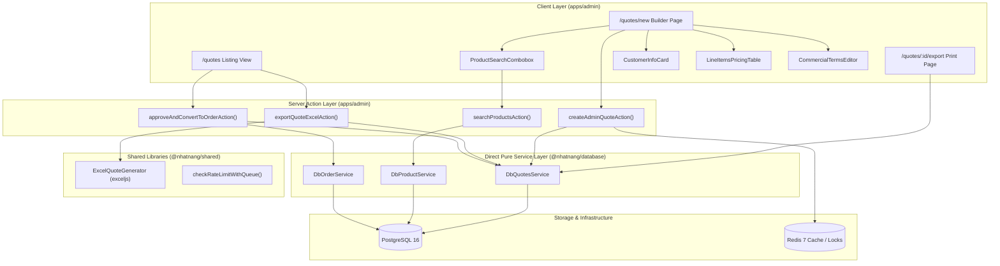
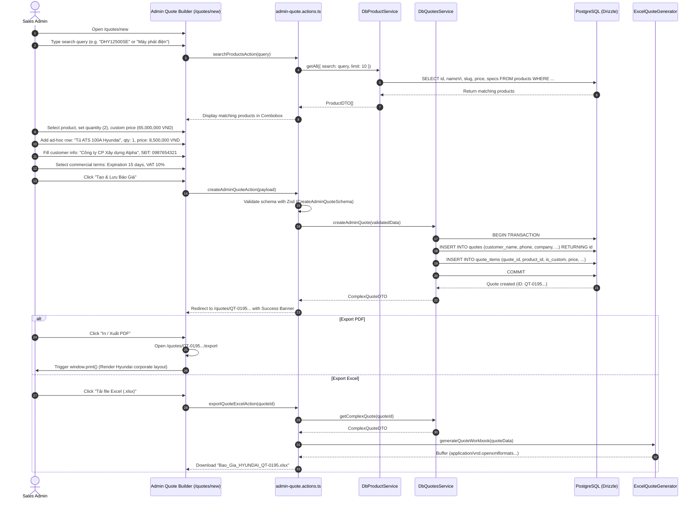
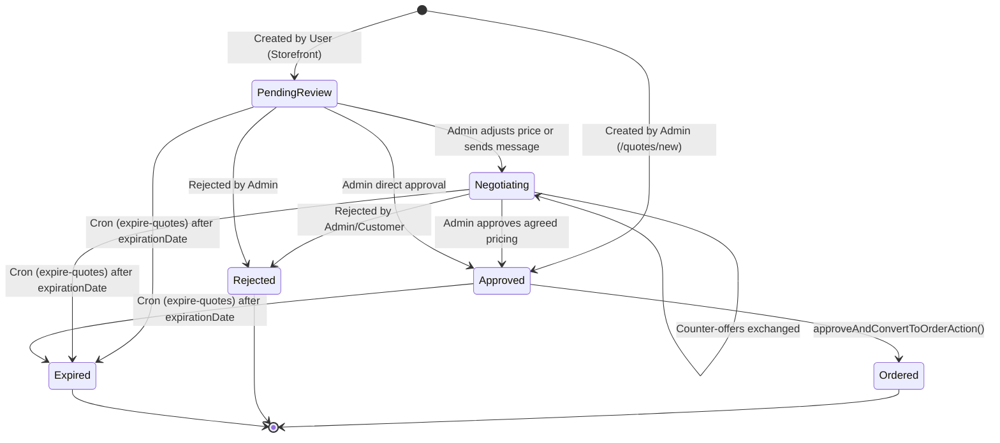

# Admin Quote Generator & Document Export System Design

## Overview & Context

### 1. Business Context & Problem Statement
In B2B industrial equipment and power generation sales (Hyundai Generators), sales representatives and backoffice administrators frequently negotiate customized pricing packages with contractors, distributors, dealers, and walk-in commercial clients. Currently, the admin portal (`apps/admin`) only supports receiving quotes initiated by registered portal users, lacking the capability for administrators to proactively construct, price, and export formal quote documents.

This design specifies an end-to-end **Admin Quote Generator & Document Export System** enabling sales staff to search generator models by name, SKU, or specification, assemble multi-item quotes with customized line-item discounts and ad-hoc installation/accessory charges, capture customer contact credentials, persist quotes within the PostgreSQL database, and produce client-ready export documents in both printable HTML/PDF and structured Excel (`.xlsx`) formats.

### 2. Goals
- **G1 (Intelligent Product Discovery)**: Provide an instant, debounced autocomplete combobox/modal to search products by name (`nameVi`/`nameEn`), model/SKU, or category within `apps/admin`.
- **G2 (Flexible Customer Capture)**: Support linking existing registered B2B accounts (`userId`) or capturing walk-in/ad-hoc customer profiles directly into strongly-typed relational snapshot columns without polluting the `users` table.
- **G3 (Commercial Line Item Flexibility)**: Enable per-item price overrides, percentage discounts, and custom ad-hoc line items (e.g. ATS auto-transfer switches, installation labor, delivery fees) that do not require pre-existing catalog SKUs.
- **G4 (Dual-Channel Document Export)**:
  - **Channel 1 (Printable HTML/PDF)**: High-resolution corporate print view matching Hyundai brand guidelines with technical specification tables, company stamp/signature areas, and `@media print` CSS optimization.
  - **Channel 2 (Excel Spreadsheet)**: Structured `.xlsx` workbook generated via `exceljs` featuring auto-formatted currency cells, corporate styling, and breakdown formulas.
- **G5 (Order Conversion Pipeline)**: Enable one-click conversion of finalized quotes into confirmed Orders (`orders`), maintaining full audit traceability.

### 3. Non-Goals
- **NG1 (Automated Payment Processing)**: Payment collection and PayOS webhook integration occur strictly after quote approval and order conversion.
- **NG2 (Inventory Hard-Locks during Quoting)**: Generating a quote does not decrease or lock warehouse stock (`warehouseStocks`); stock reservation is executed when an approved quote is converted to an active Order.

---

## Architecture

The system spans `apps/admin`, `@nhatnang/database`, and `@nhatnang/shared`, adhering to the **Next.js Direct Service Architecture** (ADR 0002 & ADR 0013).



### Module Responsibilities

| Container / Layer | Key File / Module | Responsibility |
| :--- | :--- | :--- |
| **Admin Route: Creator** | `apps/admin/app/[locale]/(dashboard)/quotes/new/page.tsx` | Main interactive quote composer layout. |
| **Admin Route: Print/Export** | `apps/admin/app/quotes/[id]/export/page.tsx` | Clean, headerless print layout optimized for browser PDF generation. |
| **Component: Product Picker** | `apps/admin/src/features/quotes/components/product-search-modal.tsx` | Debounced live search with stock badge, thumbnail, and specification preview. |
| **Component: Pricing Cockpit** | `apps/admin/src/features/quotes/components/quote-line-items-table.tsx` | Dynamic rows for catalog items + ad-hoc items, computing subtotal, VAT, and grand total. |
| **Server Actions** | `apps/admin/src/features/quotes/actions/admin-quote.actions.ts` | Zod validation, auth session check, and service orchestration. |
| **Database Schemas** | `packages/database/src/schemas/quotes.schema.ts` | Strongly-typed columns for customer snapshot and custom quote items. |
| **Service Implementation** | `packages/database/src/services/quotes/quotes.service.ts` | Atomic transaction logic for quote generation and complex relational fetching. |
| **Excel Generation Utility** | `packages/shared/src/lib/excel-quote-generator.ts` | Generates `.xlsx` buffer with styled headers, borders, and number formatting. |

---

## Operational Flow

### 1. End-to-End Quote Creation & Export Sequence



### 2. Quote State Machine Lifecycle



---

## Work Breakdown Structure

| WBS Code | Component / Feature | Level | Description / Task | Output / Artifact |
| :--- | :--- | :--- | :--- | :--- |
| `1.0` | **Database & Domain Models** | L1: Package | Schema migration & DTO definitions in `@nhatnang/database` | `packages/database` |
| `1.1` | Schema Evolution | L2: Schema | Add typed customer columns to `quotes` and custom flags to `quote_items` | `packages/database/src/schemas/quotes.schema.ts` |
| `1.2` | DTOs & Validation | L2: DTO | Create `CreateAdminQuoteDTO` & Zod validator | `packages/database/src/dtos/quotes.dto.ts` |
| `1.3` | Service Operations | L2: Service | Implement `createAdminQuote` transaction and complex fetch query | `packages/database/src/services/quotes/quotes.service.ts` |
| `1.4` | Unit & Service Tests | L3: Test | Assert atomic creation, price calculation, and guest customer persistence | `packages/database/src/services/quotes/quotes.service.test.ts` |
| `2.0` | **Shared Export Libraries** | L1: Package | Document generation utilities in `@nhatnang/shared` | `packages/shared` |
| `2.1` | Excel Generator Engine | L2: Utility | Implement `ExcelQuoteGenerator` using `exceljs` with corporate styling | `packages/shared/src/lib/excel-quote-generator.ts` |
| `2.2` | Excel Unit Tests | L3: Test | Assert workbook sheet structure, numeric cells, and VAT calculations | `packages/shared/src/lib/excel-quote-generator.test.ts` |
| `3.0` | **Admin UI & Components** | L1: Application | Backoffice quote generator interfaces in `apps/admin` | `apps/admin` |
| `3.1` | Product Search Combobox | L2: Component | Debounced product lookup dialog with specification and stock previews | `apps/admin/src/features/quotes/components/product-search-modal.tsx` |
| `3.2` | Line Items Table | L2: Component | Dynamic table supporting catalog items, ad-hoc items, discounts, and VAT | `apps/admin/src/features/quotes/components/quote-line-items-table.tsx` |
| `3.3` | Customer Info Form | L2: Component | Form for customer contact details with autocompletion for registered users | `apps/admin/src/features/quotes/components/customer-info-form.tsx` |
| `3.4` | Commercial Terms Editor | L2: Component | Editable boilerplate terms (validity, payment schedule, warranty, delivery) | `apps/admin/src/features/quotes/components/commercial-terms-editor.tsx` |
| `3.5` | Quote Composer Page | L2: Route | Integrate all builder sections into `/quotes/new` | `apps/admin/app/[locale]/(dashboard)/quotes/new/page.tsx` |
| `3.6` | Printable HTML View | L2: Route | Clean corporate print layout with `@media print` stylesheets | `apps/admin/app/quotes/[id]/export/page.tsx` |
| `4.0` | **Server Actions & Security** | L1: Application | Server action handlers and role enforcement | `apps/admin/src/features/quotes/actions` |
| `4.1` | Admin Quote Actions | L2: Action | Implement `createAdminQuoteAction` and `exportQuoteExcelAction` | `apps/admin/src/features/quotes/actions/quote.actions.ts` |
| `4.2` | Action Unit Tests | L3: Test | Test session validation, input sanitization, and path revalidation | `apps/admin/src/features/quotes/actions/quote.actions.test.ts` |

---

## Data Contracts

### 1. Database Schema Specifications (`quotes.schema.ts`)

```ts
import { pgTable, uuid, varchar, text, timestamp, integer, boolean, numeric, jsonb } from "drizzle-orm/pg-core";
import { users } from "./auth.schema";
import { products } from "./product.schema";

export const quoteStatusEnum = ["pending_review", "negotiating", "approved", "rejected", "expired"] as const;

export const quotes = pgTable("quotes", {
  id: uuid("id").defaultRandom().primaryKey(),
  quoteNumber: varchar("quote_number", { length: 32 }).notNull().unique(), // e.g. QT-20260902-001
  userId: uuid("user_id").references(() => users.id, { onDelete: "set null" }), // Nullable for guest/walk-in clients
  
  // Strongly-Typed Relational Customer Snapshot
  customerName: varchar("customer_name", { length: 255 }).notNull(),
  customerPhone: varchar("customer_phone", { length: 20 }).notNull(),
  customerEmail: varchar("customer_email", { length: 255 }),
  companyName: varchar("company_name", { length: 255 }),
  taxId: varchar("tax_id", { length: 50 }),
  shippingAddress: text("shipping_address"),
  
  // Financial Totals
  status: varchar("status", { length: 32, enum: quoteStatusEnum }).default("approved").notNull(),
  subtotalPrice: numeric("subtotal_price", { precision: 15, scale: 2 }).notNull(),
  vatRate: integer("vat_rate").default(10).notNull(), // 8% or 10%
  vatAmount: numeric("vat_amount", { precision: 15, scale: 2 }).notNull(),
  totalQuotedPrice: numeric("total_quoted_price", { precision: 15, scale: 2 }).notNull(),
  
  // Commercial Terms Snapshot
  commercialTerms: jsonb("commercial_terms").$type<{
    validityDays: number;
    paymentSchedule: string;
    warrantyTerms: string;
    deliveryTime: string;
    deliveryLocation: string;
  }>(),
  
  expirationDate: timestamp("expiration_date", { withTimezone: true, mode: "date" }).notNull(),
  note: text("note"),
  orderId: uuid("order_id"), // Linked order when converted
  createdByAdminId: uuid("created_by_admin_id").references(() => users.id),
  createdAt: timestamp("created_at", { withTimezone: true, mode: "date" }).defaultNow().notNull(),
  updatedAt: timestamp("updated_at", { withTimezone: true, mode: "date" }).defaultNow().notNull(),
});

export const quoteItems = pgTable("quote_items", {
  id: uuid("id").defaultRandom().primaryKey(),
  quoteId: uuid("quote_id").notNull().references(() => quotes.id, { onDelete: "cascade" }),
  productId: uuid("product_id").references(() => products.id, { onDelete: "set null" }), // Nullable if ad-hoc item
  
  // Item Identity & Specifications
  isCustomItem: boolean("is_custom_item").default(false).notNull(),
  itemName: varchar("item_name", { length: 255 }).notNull(),
  itemModel: varchar("item_model", { length: 100 }),
  itemSpecs: text("item_specs"), // Short specs summary for quote document
  
  // Pricing Metrics
  quantity: integer("quantity").notNull(),
  unitPrice: numeric("unit_price", { precision: 15, scale: 2 }).notNull(),
  discountPercent: numeric("discount_percent", { precision: 5, scale: 2 }).default("0").notNull(),
  finalUnitPrice: numeric("final_unit_price", { precision: 15, scale: 2 }).notNull(),
  totalPrice: numeric("total_price", { precision: 15, scale: 2 }).notNull(),
  
  createdAt: timestamp("created_at", { withTimezone: true, mode: "date" }).defaultNow().notNull(),
});
```

### 2. Input Validation Schema (Zod)

```ts
import { z } from "zod";

export const QuoteItemInputSchema = z.object({
  productId: z.string().uuid().optional(),
  isCustomItem: z.boolean().default(false),
  itemName: z.string().min(1, "Tên sản phẩm/hạng mục không được để trống"),
  itemModel: z.string().optional(),
  itemSpecs: z.string().optional(),
  quantity: z.number().int().positive("Số lượng phải lớn hơn 0"),
  unitPrice: z.number().nonnegative("Đơn giá không được âm"),
  discountPercent: z.number().min(0).max(100).default(0),
});

export const CreateAdminQuoteSchema = z.object({
  userId: z.string().uuid().optional(),
  customerName: z.string().min(2, "Tên khách hàng tối thiểu 2 ký tự"),
  customerPhone: z.string().regex(/^[0-9+() -]{8,20}$/, "Số điện thoại không hợp lệ"),
  customerEmail: z.string().email("Email không hợp lệ").optional().or(z.literal("")),
  companyName: z.string().optional(),
  taxId: z.string().optional(),
  shippingAddress: z.string().optional(),
  vatRate: z.number().int().min(0).max(20).default(10),
  commercialTerms: z.object({
    validityDays: z.number().int().positive().default(15),
    paymentSchedule: z.string().min(1),
    warrantyTerms: z.string().min(1),
    deliveryTime: z.string().min(1),
    deliveryLocation: z.string().optional(),
  }),
  note: z.string().optional(),
  items: z.array(QuoteItemInputSchema).min(1, "Báo giá phải có ít nhất 1 sản phẩm hoặc hạng mục"),
});

export type CreateAdminQuoteDTO = z.infer<typeof CreateAdminQuoteSchema>;
```

---

## Security & Reliability

### 1. Role-Based Access Control (RBAC)
- All creator endpoints (`/quotes/new`) and server actions (`createAdminQuoteAction`, `exportQuoteExcelAction`) enforce session validation using `getCachedSession()`.
- Access is restricted exclusively to authenticated users with `role: "admin"` or `role: "staff"`. Unauthorized attempts return HTTP 403 Forbidden.

### 2. Input Sanitization & Anti-XSS
- Customer names, company names, notes, and custom item descriptions are sanitized before persistence to eliminate injected `<script>` tags, malicious attributes, or dangerous protocols.
- Numeric computations (subtotal, VAT amount, grand total) are calculated deterministically server-side within `quotes.service.ts`; client-submitted totals are ignored and recomputed to prevent tampering.

### 3. Transactional Integrity (ACID)
- Database mutations execute inside an isolated `db.transaction(async (tx) => { ... })`. If inserting quote items or computing aggregates encounters an error, the entire transaction is rolled back atomically.

### 4. Rate Limiting & Resource Protection
- Quote export endpoints apply Redis sliding-window rate limiting via `checkRateLimitWithQueue()` to prevent Excel/PDF generation denial-of-service spikes.
