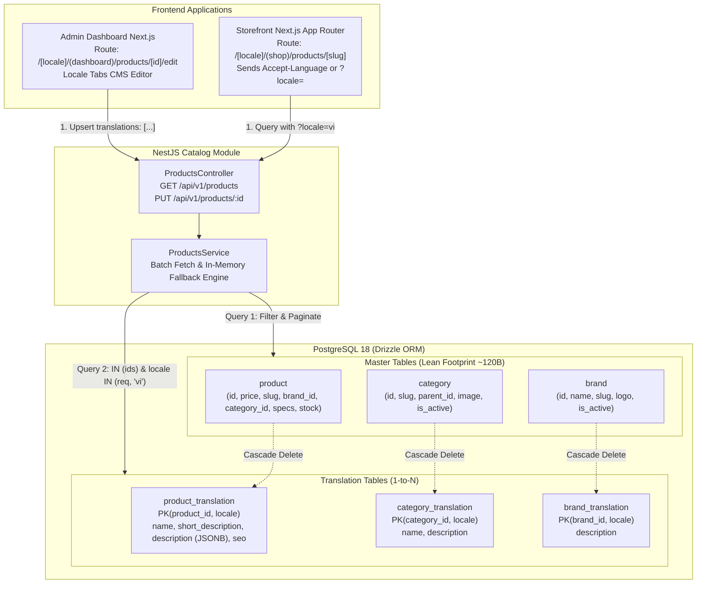
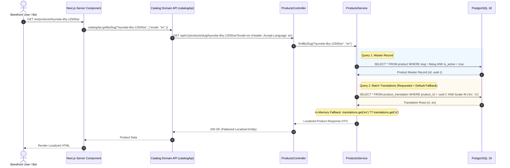
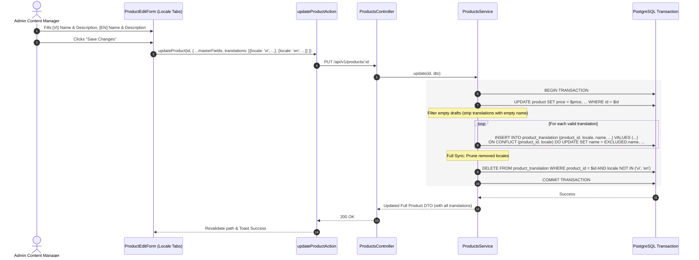
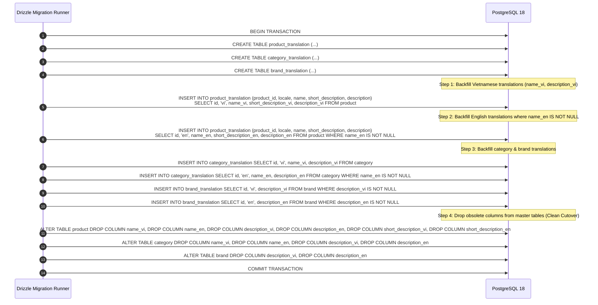

# Catalog Multilingual Translation Table System Design

## Overview & Context

### Executive Summary
This system design formalizes the implementation of **Issue #138** and operationalizes **ADR 0001** (`backend/docs/adr/0001-catalog-multilingual-translation-table-tradeoffs.md`). It transitions the Hyundai E-commerce platform catalog (`products`, `categories`, `brands`) from the rigid **Column-per-Locale model** (`nameVi`, `nameEn`, `descriptionVi`, `descriptionEn`) to a scalable **Translation Table Pattern (Model B)**.

### Business & Engineering Goals
1. **Strict Compile-Time Type Safety**: 100% type inference via Drizzle ORM (`$inferSelect` / `$inferInsert`), eliminating untyped/runtime-fragile JSON dictionaries.
2. **Relational Database Integrity**: Native PostgreSQL `NOT NULL` constraints on translatable fields and `UNIQUE (entity_id, locale)` compound primary keys.
3. **Zero-Migration Multi-Language Scalability**: Adding future locales (e.g., `ko`, `ja`, `zh`) requires zero `ALTER TABLE` DDL migrations.
4. **Master Table Compaction**: Stripping extensive text and rich-text columns from the master `products` table reduces its row footprint from ~2KB to ~120 bytes. This dramatically increases the number of product rows per 8KB PostgreSQL shared buffer page, accelerating inventory checks, price filtering, and `SELECT ... FOR UPDATE` row locks.
5. **High-Performance Query Resolution**: Mitigates the "Double-Join Fallback Tax" via a 2-Query Parallel Batch Fetching architecture with $O(1)$ in-memory fallback resolution in NestJS.
6. **Unified Canonical SEO Routing**: Retains a single global `slug` on the master tables, providing clean, predictable URLs across all language routes (`/vi/products/[slug]` and `/en/products/[slug]`) without cross-locale redirect debt.

### Non-Goals
- **Per-locale distinct slugs**: Preserving a single canonical keyword-rich `slug` per master entity avoids cross-locale redirect chains and routing conflicts.
- **Machine Translation Runtime**: Content is human-authored via the Backoffice CMS; no runtime automated translation APIs are invoked.
- **Multi-currency pricing**: Financial metrics remain unified in VND; translations govern linguistic representation only.

---

## Architecture



### Architectural Decisions & Standards

1. **Content Negotiation Standard**:
   - **Frontend Browser**: Strictly path-based (`/vi/...`, `/en/...`) for Googlebot SEO crawling, `hreflang` indexing, and link sharing.
   - **Backend REST API**: Standard RESTful RFC 9110 content negotiation via `Accept-Language: <locale>` header with fallback query parameter `?locale=<locale>`.
2. **Compound Primary Keys**:
   - Every translation table uses `PRIMARY KEY (entity_id, locale)` to guarantee at the database level that exactly one translation row exists per language.
3. **Rich-Text Description Preservation**:
   - `product_translation.description` strictly uses `jsonb().$type<JSONContent>()` matching TipTap AST representation.
   - `category_translation.description` and `brand_translation.description` use PostgreSQL native `text()`.
4. **Single Global Slug Invariant**:
   - `slug: text().notNull().unique()` remains on `products`, `categories`, and `brands`. Slugs are unified across locales, eliminating cross-language URL drift.

---

## Operational Flow

### 1. Storefront Localized Catalog Resolution Flow



### 2. Admin Multi-Lingual Product Mutation (Locale Tabs Sync)



### 3. Data Migration & Zero-Downtime Clean Cutover Flow



---

## Work Breakdown Structure

| WBS Code | Component / Feature | Level | Description / Task | Output / Artifact |
| :--- | :--- | :--- | :--- | :--- |
| `1.0` | **Database Schema & DDL** | L1: Module | Drizzle ORM entity definitions & migration script | `backend/src/database/` |
| `1.1` | Translation Tables DDL | L2: Component | Define `productTranslations`, `categoryTranslations`, `brandTranslations` | `schemas/product.schema.ts`, `category.schema.ts`, `brand.schema.ts` |
| `1.2` | Master Table Compaction | L2: Component | Remove obsolete columns from master Drizzle tables | `schemas/*.schema.ts` |
| `1.3` | Backfill Migration Script | L3: Task | SQL data migration copying `*Vi`/`*En` to translation rows and dropping old columns | `backend/drizzle/*.sql` |
| `1.4` | DB Verification | L4: Execution | Run migration and verify row counts and integrity | `bun run db:migrate` |
| `2.0` | **Backend Catalog Services** | L1: Module | NestJS catalog service layer with batch fallback engine | `backend/src/modules/catalog/` |
| `2.1` | DTO Layer Refactoring | L2: Component | Zod schemas for `translations: [...]` and localized read models | `catalog/dto/*.dto.ts` |
| `2.2` | In-Memory Fallback Engine | L3: Task | 2-Query batch fetcher with $O(1)$ locale map resolution | `products.service.ts`, `categories.service.ts`, `brands.service.ts` |
| `2.3` | Full-Sync Mutation Logic | L3: Task | Transactional upsert with empty-draft filtering and prune | `products.service.ts:create/update` |
| `2.4` | Facet Metadata Localization | L3: Task | Localize `categoryFacetItem: { id, name, count }` based on `?locale=` | `products.service.ts:getFilterMetadata` |
| `2.5` | Backend Test Suite | L4: Execution | Unit tests for batch queries, fallbacks, and transactions | `bun test src/modules/catalog/` |
| `3.0` | **Admin Dashboard CMS** | L1: Module | Multi-lingual authoring UI & server action migration | `admin/src/features/` |
| `3.1` | Locale Tabs Component | L2: Component | Reusable language tab switcher (`[VI]`, `[EN]`) | `admin/src/shared/components/locale-tabs.tsx` |
| `3.2` | Product Form Refactoring | L3: Task | Integrate Locale Tabs into `/products/new` and `/products/[id]/edit` | `features/products/components/product-form.tsx` |
| `3.3` | Server Actions Adaptation | L3: Task | Update server actions to submit `translations: [...]` payload | `features/products/actions/product.actions.ts` |
| `3.4` | Admin Quality Gate | L4: Execution | Verify typecheck and production build | `bun run check-types:admin && bun run build` |
| `4.0` | **Storefront Catalog** | L1: Module | Localized catalog display & static params generation | `storefront/` |
| `4.1` | Catalog Domain API Sync | L2: Component | Pass `Accept-Language` header and `?locale=` query | `storefront/src/shared/api/catalog.api.ts` |
| `4.2` | Static Params Generation | L3: Task | Verify `generateStaticParams` works with canonical slugs | `app/[locale]/(shop)/products/[slug]/page.tsx` |
| `4.3` | Storefront Quality Gate | L4: Execution | Verify typecheck, lint, and production static build | `bun run check-types:storefront && bun run build` |

---

## Data Contracts

### 1. Database Schemas (Drizzle ORM)

```typescript
// backend/src/database/schemas/product.schema.ts

export const productTranslations = snakeCase.table(
  "product_translation",
  {
    productId: uuid("product_id")
      .notNull()
      .references(() => products.id, { onDelete: "cascade" }),
    locale: varchar("locale", { length: 8 }).notNull(), // 'vi', 'en', 'ko', 'ja'
    name: text("name").notNull(),
    shortDescription: text("short_description"),
    description: jsonb("description").$type<JSONContent>(),
    seoTitle: text("seo_title"),
    seoDescription: text("seo_description"),
  },
  (table) => [
    primaryKey({ columns: [table.productId, table.locale] }),
    index("product_translation_product_locale_idx").on(table.productId, table.locale),
  ],
);

export const categoryTranslations = snakeCase.table(
  "category_translation",
  {
    categoryId: uuid("category_id")
      .notNull()
      .references(() => categories.id, { onDelete: "cascade" }),
    locale: varchar("locale", { length: 8 }).notNull(),
    name: text("name").notNull(),
    description: text("description"),
  },
  (table) => [
    primaryKey({ columns: [table.categoryId, table.locale] }),
    index("category_translation_category_locale_idx").on(table.categoryId, table.locale),
  ],
);

export const brandTranslations = snakeCase.table(
  "brand_translation",
  {
    brandId: uuid("brand_id")
      .notNull()
      .references(() => brands.id, { onDelete: "cascade" }),
    locale: varchar("locale", { length: 8 }).notNull(),
    description: text("description"),
  },
  (table) => [
    primaryKey({ columns: [table.brandId, table.locale] }),
  ],
);
```

### 2. API Data Transfer Objects (Zod Schemas)

#### Write Contract (Admin Create / Update)
```typescript
export const productTranslationInputSchema = z.object({
  locale: z.string().min(2).max(8),
  name: z.string().trim().min(1, "Product name is required"),
  shortDescription: z.string().nullable().optional(),
  description: z.custom<JSONContent>().nullable().optional(),
  seoTitle: z.string().nullable().optional(),
  seoDescription: z.string().nullable().optional(),
});

export const createProductSchema = z.object({
  // Master Technical Attributes
  slug: z.string().min(1),
  price: z.string().regex(/^\d+(\.\d{1,2})?$/),
  brandId: z.uuid().nullable().optional(),
  categoryId: z.uuid().nullable().optional(),
  images: z.array(z.string()).default([]),
  powerKva: z.string().nullable().optional(),
  powerKw: z.string().nullable().optional(),
  // ... other generator / UPS technical specs
  
  // Localized Translations Array
  translations: z
    .array(productTranslationInputSchema)
    .min(1, "At least one translation is required")
    .refine(
      (items) => items.some((item) => item.locale === "vi" && item.name.length > 0),
      { message: "Vietnamese (vi) primary translation is mandatory" },
    ),
});
```

#### Read Contract (Storefront Localized Response)
```typescript
export const localizedProductResponseSchema = z.object({
  id: z.uuid(),
  slug: z.string(),
  price: z.string(),
  images: z.array(z.string()),
  brandId: z.uuid().nullable(),
  categoryId: z.uuid().nullable(),
  // Resolved localized fields (Requested Locale with fallback to 'vi')
  name: z.string(),
  shortDescription: z.string().nullable(),
  description: z.custom<JSONContent>().nullable(),
  seoTitle: z.string().nullable(),
  seoDescription: z.string().nullable(),
  // Technical specs
  specs: z.record(z.unknown()),
  totalStockCache: z.number(),
  createdAt: z.date(),
  updatedAt: z.date(),
});
```

#### Read Contract (Admin Full Response for CMS Edit)
```typescript
export const adminProductDetailResponseSchema = localizedProductResponseSchema.extend({
  translations: z.array(productTranslationInputSchema),
});
```

---

## Security & Reliability

1. **Foreign Key Integrity & Cascading**:
   - Every translation row references its parent master row with `ON DELETE CASCADE`. If a product, category, or brand is deleted, all historical translations are automatically purged by PostgreSQL, eliminating orphan rows.
2. **Mandatory Fallback Guarantee**:
   - The primary locale (`vi`) is validated strictly at the DTO layer. The in-memory fallback engine guarantees that storefront consumers never receive null or empty product titles, even when viewing non-translated secondary locales.
3. **Empty Draft Translation Sanitization**:
   - To prevent database bloat, the service layer strips secondary translations whose `name` is empty or only whitespace before triggering database upserts.
4. **Historical Order Snapshot Isolation**:
   - Order line items (`order_item`) retain `productName: text().notNull()` captured as an immutable snapshot at checkout time. Future modifications to translations do not alter financial or invoice history.
5. **Full-Text Search Stemming Readiness**:
   - Separating translations by locale allows future indexing using language-specific PostgreSQL text search configurations (`pg_catalog.simple` for Vietnamese, `pg_catalog.english` for English).
