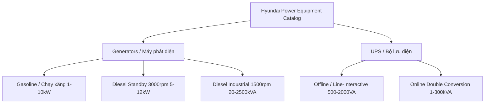

# Product Specifications Architecture & Industrial Catalog Analysis Design

## 1. Executive Summary & Problem Statement

### 1.1 Current Architecture & Pain Points

In `@nhatnang/database` (`packages/database/src/schemas/product.schema.ts`), technical specifications for power equipment (Hyundai generators, UPS systems, and accessories) are stored inside a single unstructured `jsonb` column:

```ts
specs: jsonb().$type<ProductSpecs>().default({});
```

This implementation causes critical architectural and operational bottlenecks:

1. **Unindexed & Regex-Based Filtering**: Querying numeric values (e.g. `power`, `voltage`) requires raw SQL string parsing and regular expression matching (`CASE WHEN specs->>'power' ~ '^\s*\d+(\.\d+)?\s*$' THEN (specs->>'power')::numeric ELSE NULL END`), destroying query planner predictability and bypassing Drizzle ORM's native type-safe builders (`gt`, `lt`, `between`, `eq`).
2. **Hardcoded, Brittle Admin Forms**: `apps/admin/src/features/products/components/specs/` hardcodes 20+ fields (`specs.power`, `specs.engineBrand`, `specs.noiseLevel`, etc.). It lacks adaptability for diverse product lines such as UPS (which have no engines or alternators) or ATS panels.
3. **Absence of Spec Sheet Taxonomy (Display Groups & Units)**: Technical data sheets presented to B2B customers on the storefront or in formal quotation documents (`QuotePrintDocument`) require structured groupings (General, Engine, Alternator, Controller, Battery) with units of measurement (kVA, kW, V, L/h, dB(A), mm, kg). The flat JSON object cannot represent display order, localization, or units.

### 1.2 Decision: Hybrid Architecture (Model 1)

Following research into primary sources from official Hyundai equipment catalogs (`hyundaipowerequipment.co.uk`, `hyundaigensets.com`, `hyundainhatnang.com`) and industrial e-commerce standards, we adopt **Hybrid Model 1**:

- **Layer 1 (Faceted Relational Columns)**: Core parameters used for searching, sorting, and faceted filtering (`powerKva`, `powerKw`, `phase`, `voltage`, `fuelType`, `canopyType`, `startMethod`, `upsTopology`, `engineBrand`, `alternatorBrand`) are promoted to dedicated, indexed PostgreSQL columns in the `products` table.
- **Layer 2 (Grouped Spec Sheet)**: The full technical data sheet is stored as a typed, structured array of groups (`specSheet: SpecGroup[]`) containing localized titles, item labels, values, and units.

---

## 2. Primary Source Catalog Research & Technical Taxonomy

Analysis of official Hyundai manufacturer documentation across four distinct product lines reveals the core parameters required by customers and engineers:



### 2.1 Product Line 1: Gasoline Generators (Máy phát điện chạy xăng gia đình & Inverter)

_Primary Sources: Hyundai HY10000LEK-2, HY3200SEi Inverter Spec Sheets_

- **Target Segment**: Residential backup, camping, construction trade, sensitive electronic equipment.
- **Power Range**: 1.0 kW – 10.0 kW (1.25 kVA – 12.5 kVA). Cosφ = 1.0 (Inverter) or 0.8.
- **Critical Filter Attributes**:
  - `fuelType`: `gasoline` (Xăng)
  - `phase`: `1phase` (Single Phase 230V / 115V)
  - `startMethod`: `recoil` (Giật nổ), `electric` (Đề điện), `remote` (Khóa điều khiển từ xa)
  - `canopyType`: `open_frame` (Khung trần) or `closed_case` (Vali chống ồn)
- **Detailed Spec Sheet Parameters**:
  - **General**: Rated/Max Power (kW, kVA), Sockets (e.g. 1x 230V/32A, 2x 115V/16A, 12V DC), Run time @ 50% load, Fuel tank capacity (L), Noise level @ 7m (dB(A)).
  - **Engine**: Engine model (e.g. SC460, DJ170F), Displacement (cc), 4-Stroke OHV Air-cooled, Rated RPM (3000 or 3600 rpm), Engine oil capacity (ml) & grade (10W40/15W40).
  - **Alternator**: Inverter board (Pure Sine Wave) or AVR copper-wound alternator.
  - **Features**: ECO mode, Low oil shutdown, Digital overload protection, LCD/digital hour meter.

---

### 2.2 Product Line 2: Portable & Standby Diesel Generators (Máy phát điện chạy dầu 3000rpm)

_Primary Sources: Hyundai DHY6000SE, DHY8000SELR-T Multi-Phase Spec Sheets_

- **Target Segment**: Commercial workshops, small businesses, villas, telecommunication stations.
- **Power Range**: 5.0 kW – 12.0 kW (6.25 kVA – 15.0 kVA).
- **Critical Filter Attributes**:
  - `fuelType`: `diesel` (Dầu Diesel)
  - `phase`: `1phase`, `3phase`, or `multi_phase` (Dual voltage switchable 230V/400V)
  - `canopyType`: `silent` (Vỏ cách âm đệm mút cách âm, độ ồn ~68-72 dB @ 7m)
  - `startMethod`: `electric` with ATS auto-start port (2-wire ATS contact)
- **Detailed Spec Sheet Parameters**:
  - **General**: Continuous kW/kVA, Standby kW/kVA, Current (A), Voltage (230V, 400V), Fuel capacity (Standard 15L or Long-run 25L/30L), Fuel consumption rate (L/h @ 100% load), Net/Gross Weight (kg).
  - **Engine**: Single-cylinder forced air-cooled diesel (e.g. D450 456cc, D500 498cc), Mechanical governor, 3000 RPM, Glow plug / Pre-heater.
  - **Alternator**: Brushed/Brushless with AVR, 100% copper windings, Cosφ = 0.8 (3-phase) or 1.0 (1-phase).
  - **Control & Protection**: LED display (V, A, Hz, hours), Overload thermal breakers (3P 9.5A, 1P 21A), Emergency stop button, ATS connector socket.

---

### 2.3 Product Line 3: Industrial Diesel Generators (Máy phát điện công nghiệp 1500rpm 3 pha)

_Primary Sources: Hyundai DHY65KSE, DHY110KSE, DHY220KSE Industrial Data Sheets_

- **Target Segment**: Factories, hospitals, data centers, high-rise buildings, construction sites.
- **Power Range**: 20 kVA – 2500 kVA (16 kW – 2000 kW).
- **Critical Filter Attributes**:
  - `fuelType`: `diesel`
  - `phase`: `3phase` (3 pha 4 dây, 230/400V hoặc 220/380V)
  - `engineBrand`: Hyundai, Cummins, Perkins, Doosan, Baudouin, Mitsubishi, Kubota.
  - `alternatorBrand`: Stamford, Leroy Somer, Mecc Alte, Hyundai.
  - `canopyType`: `silent` (Vỏ chống ồn sơn tĩnh điện ngoài trời) or `open_frame` (Máy trần đặt phòng kỹ thuật).
- **Detailed Spec Sheet Parameters**:
  - **Engine Group**: Model (e.g. HY4DX23, 6BTAA5.9-G2), Number of cylinders (4L, 6L, V12), Bore x Stroke (mm), Compression ratio, Aspiration (Turbocharged / Intercooled), Cooling system (Water-cooled radiator), Lube oil capacity (L), Coolant capacity (L), Governor (Electronic / Mechanical).
  - **Alternator Group**: Model (e.g. 224G48, UCI274), Excitation (Brushless, self-exciting), AVR model (SX460, AS440), Insulation class H, Protection rating IP23.
  - **Control & Monitoring Group**: Digital Controller (ComAp AMF20/AMF25, DeepSea DSE7320, SmartGen), LCD multi-parameter display, Full telemetry (Oil pressure, Water temperature, Engine speed, Battery voltage, Run hours, Active/Reactive power, Phase rotation), Auto-shutdown faults, RS485 / Modbus / SNMP remote monitoring interface.
  - **Dimensions & Enclosure**: Overall dimensions L x W x H (mm), Dry weight, Base fuel tank (8-10h run capacity), Exhaust silencer, Vibration isolators.

---

### 2.4 Product Line 4: UPS Systems (Bộ lưu điện Hyundai)

_Primary Sources: Hyundai HD-10KS, HD-10KT9, HD-1500VA Official Data Sheets_

- **Target Segment**: IT servers, medical equipment, networking, industrial automation.
- **Topology Taxonomy**:
  1. **Offline / Line-Interactive** (HD-500VA to HD-2000VA): Modified sine wave, transfer time 2-6ms, internal battery.
  2. **Online Double Conversion** (HD-1KT9 to HD-10KT9 Tower, HD-1KR to HD-10KR Rack): Pure sine wave, zero transfer time (0ms), DSP digital control.
- **Critical Filter Attributes**:
  - `productType`: `ups`
  - `powerKva`: 0.5 kVA – 300 kVA
  - `powerKw`: 0.3 kW – 270 kW (Power factor 0.9 on modern online units)
  - `phase`: `1phase` (1:1), `3phase_1phase` (3:1), `3phase` (3:3)
  - `upsTopology`: `offline`, `line_interactive`, `online_double_conversion`
  - `canopyType`: `tower` (dạng đứng) or `rackmount` (ngăn kéo 19" 2U/3U)
  - `upsBatteryType`: `internal` (Ắc quy trong tiêu chuẩn) or `external` (Tủ ắc quy rời mở rộng)
- **Detailed Spec Sheet Parameters**:
  - **Input**: Voltage range (110V - 300V AC), Frequency range (46 - 54Hz / 50Hz), Input Power Factor (> 0.99).
  - **Output**: Output voltage (220V ± 1%), Frequency (50Hz/60Hz ± 0.1%), Crest factor (3:1), Total Harmonic Distortion (THDv < 2% linear load), Sockets (IEC C13/C19, Terminal block).
  - **Battery & Charger**: DC bus voltage (24V, 36V, 72V, 96V, 192V), Recharge time to 90% (4-6 hours), Max charging current (1A standard, 5A-10A for external battery models).
  - **Transfer & Efficiency**: Transfer time (0 ms inverter online, 0 ms to bypass), Overall AC-AC efficiency (> 92-94%), ECO mode efficiency (> 98%).
  - **Interface**: RS232, USB, Intelligent slot for SNMP card, Emergency Power Off (EPO).

---

## 3. Database Schema & Type Architecture

### 3.1 Relational Columns in `products` Table (`packages/database/src/schemas/product.schema.ts`)

```ts
import {
  pgTable,
  varchar,
  numeric,
  integer,
  boolean,
  text,
  jsonb,
  index,
} from "drizzle-orm/pg-core";

export const products = pgTable(
  "product",
  {
    // ... existing primary fields (id, nameVi, nameEn, slug, price, brandId, categoryId, etc.)

    // --- CONCRETE FILTERABLE ATTRIBUTES (B-Tree Indexed) ---
    productType: varchar("product_type", { length: 30 })
      .notNull()
      .default("generator"), // 'generator' | 'ups' | 'ats' | 'accessory'

    powerKva: numeric("power_kva", { precision: 10, scale: 2 }),
    powerKw: numeric("power_kw", { precision: 10, scale: 2 }),
    standbyPowerKva: numeric("standby_power_kva", { precision: 10, scale: 2 }),
    standbyPowerKw: numeric("standby_power_kw", { precision: 10, scale: 2 }),

    phase: varchar("phase", { length: 20 }), // '1phase' | '3phase' | 'multi_phase'
    voltage: varchar("voltage", { length: 30 }), // '220V' | '380V' | '230/400V' | '115/230V'
    frequency: integer("frequency").default(50), // 50 (Hz) or 60 (Hz)

    // Generator-specific facets
    fuelType: varchar("fuel_type", { length: 20 }), // 'diesel' | 'gasoline' | 'gas'
    canopyType: varchar("canopy_type", { length: 30 }), // 'silent' | 'super_silent' | 'open_frame' | 'tower' | 'rackmount'
    startMethod: varchar("start_method", { length: 30 }), // 'electric' | 'recoil' | 'remote' | 'auto_ats'
    engineBrand: varchar("engine_brand", { length: 100 }), // 'Hyundai', 'Cummins', 'Perkins', etc.
    alternatorBrand: varchar("alternator_brand", { length: 100 }), // 'Hyundai', 'Stamford', 'Leroy Somer', etc.

    // UPS-specific facets
    upsTopology: varchar("ups_topology", { length: 30 }), // 'offline' | 'line_interactive' | 'online_double_conversion'
    upsBatteryType: varchar("ups_battery_type", { length: 20 }), // 'internal' | 'external'

    // --- STRUCTURED DATA SHEET (Detailed Spec Groups) ---
    specSheet: jsonb("spec_sheet").$type<ProductSpecSheet>().default([]),
  },
  (table) => [
    // Standard high-performance B-Tree indexes for Faceted Search
    index("product_type_idx").on(table.productType),
    index("product_power_kva_idx").on(table.powerKva),
    index("product_power_kw_idx").on(table.powerKw),
    index("product_phase_idx").on(table.phase),
    index("product_fuel_type_idx").on(table.fuelType),
    index("product_canopy_type_idx").on(table.canopyType),
    index("product_engine_brand_idx").on(table.engineBrand),
    index("product_ups_topology_idx").on(table.upsTopology),
  ],
);
```

---

### 3.2 TypeScript Types (`packages/core/src/types/product-spec.types.ts`)

```ts
export type ProductType = "generator" | "ups" | "ats" | "accessory";
export type PowerPhase = "1phase" | "3phase" | "multi_phase";
export type FuelType = "diesel" | "gasoline" | "gas";
export type CanopyType =
  | "silent"
  | "super_silent"
  | "open_frame"
  | "closed_case"
  | "tower"
  | "rackmount";
export type StartMethod = "electric" | "recoil" | "remote" | "auto_ats";
export type UpsTopology =
  "offline" | "line_interactive" | "online_double_conversion";
export type UpsBatteryType = "internal" | "external";

export interface SpecItem {
  key: string; // unique identifier within group (e.g. 'fuel_tank', 'noise_level')
  nameVi: string; // 'Dung tích bình nhiên liệu'
  nameEn: string; // 'Fuel Tank Capacity'
  value: string; // '15' or 'ComAp AMF20' or 'Water-cooled'
  unit?: string | null; // 'kVA', 'kW', 'L', 'L/h', 'dB(A)', 'mm', 'kg', 'cc', 'rpm', 'V', 'A'
}

export interface SpecGroup {
  groupKey: string; // 'general' | 'engine' | 'alternator' | 'controller' | 'ups_specs' | 'battery'
  titleVi: string; // 'Thông số chung', 'Động cơ', 'Đầu phát'
  titleEn: string; // 'General Specifications', 'Engine', 'Alternator'
  order: number; // Sorting index for UI tab / table rendering
  items: SpecItem[];
}

export type ProductSpecSheet = SpecGroup[];
```

---

### 3.3 Zod Validators (`packages/database/src/validators/product.validators.ts`)

```ts
import { z } from "zod";

export const specItemSchema = z.object({
  key: z.string().min(1),
  nameVi: z.string().min(1, "validation.specNameRequired"),
  nameEn: z.string().optional().default(""),
  value: z.string().min(1, "validation.specValueRequired"),
  unit: z.string().nullable().optional(),
});

export const specGroupSchema = z.object({
  groupKey: z.string().min(1),
  titleVi: z.string().min(1, "validation.groupTitleRequired"),
  titleEn: z.string().optional().default(""),
  order: z.number().int().default(0),
  items: z.array(specItemSchema).default([]),
});

export const specSheetSchema = z.array(specGroupSchema);

export const productFacetAttributesSchema = z.object({
  productType: z
    .enum(["generator", "ups", "ats", "accessory"])
    .default("generator"),
  powerKva: z.coerce.number().positive().nullable().optional(),
  powerKw: z.coerce.number().positive().nullable().optional(),
  standbyPowerKva: z.coerce.number().positive().nullable().optional(),
  standbyPowerKw: z.coerce.number().positive().nullable().optional(),
  phase: z.enum(["1phase", "3phase", "multi_phase"]).nullable().optional(),
  voltage: z.string().max(30).nullable().optional(),
  frequency: z.coerce.number().int().default(50).nullable().optional(),
  fuelType: z.enum(["diesel", "gasoline", "gas"]).nullable().optional(),
  canopyType: z.string().max(30).nullable().optional(),
  startMethod: z.string().max(30).nullable().optional(),
  engineBrand: z.string().max(100).nullable().optional(),
  alternatorBrand: z.string().max(100).nullable().optional(),
  upsTopology: z
    .enum(["offline", "line_interactive", "online_double_conversion"])
    .nullable()
    .optional(),
  upsBatteryType: z.enum(["internal", "external"]).nullable().optional(),
});
```

---

## 4. Preset Templates by Equipment Category

To eliminate repetitive manual data entry in `apps/admin`, the system defines pre-configured templates loaded automatically when a category is selected:

### 4.1 Template A: Industrial Diesel Generator (1500rpm 3-Phase)

- **Group 1 (`general`)**: Continuous Output (kVA/kW), Standby Output (kVA/kW), Voltage (230/400V), Frequency (50Hz), Current (A), ATS Connection (Yes/No), Fuel Tank (L), Fuel Consumption 100% Load (L/h), Sound Level @ 7m (dB(A)), Weight (kg), Dimensions L x W x H (mm).
- **Group 2 (`engine`)**: Engine Brand, Engine Model, Engine Power (kW), Rated Speed (1500 rpm), Cylinders & Arrangement, Displacement (cc/L), Cooling (Water-cooled), Governor (Electronic/Mechanical), Lube Oil Capacity (L), Coolant Capacity (L).
- **Group 3 (`alternator`)**: Alternator Brand, Alternator Model, Type (Brushless), Power Factor (Cosφ 0.8), AVR Model, Insulation Class (H), Protection Class (IP23).
- **Group 4 (`controller`)**: Controller Model (e.g. ComAp AMF20), Display (LCD), Protection Functions (Low oil, High water temp, Over-speed, Over/under voltage, Overload).
- **Group 5 (`canopy`)**: Casing Material, Coating (Powder electrostatic paint), Sound insulation foam.

### 4.2 Template B: Domestic Gasoline / Inverter Generator

- **Group 1 (`general`)**: Continuous Output (kW), Max Output (kW), Voltage (230V), Frequency (50Hz), Phase (1 Phase), Starting System (Recoil / Electric / Remote), Fuel Tank (L), Run Time @ 50% load (h), Sockets (2x 230V 13A/16A, 1x 12V DC, USB), Noise Level (dB(A) @ 7m), Net Weight (kg), Dimensions (mm).
- **Group 2 (`engine`)**: Engine Model, Displacement (cc), Engine Type (4-Stroke OHV Air-cooled), Oil Capacity (ml), Recommended Oil (10W40).
- **Group 3 (`alternator`)**: Voltage Regulation (Inverter Pure Sine Wave / AVR), Power Factor (Cosφ 1.0).
- **Group 4 (`features`)**: ECO Mode, Overload Protection, Low Oil Shutdown, Wheel Kit.

### 4.3 Template C: Online Double Conversion UPS

- **Group 1 (`general`)**: Rated Capacity (kVA/kW), Topology (Online Double Conversion), Form Factor (Tower / Rackmount 2U), Phase (1:1 or 3:1), Noise Level (< 50 dB), Dimensions (mm), Weight (kg).
- **Group 2 (`input`)**: Voltage Range (110V - 300V AC), Frequency Range (46 - 54Hz), Power Factor (> 0.99).
- **Group 3 (`output`)**: Voltage (220V ± 1%), Frequency (50Hz ± 0.1%), Waveform (Pure Sine Wave), Crest Factor (3:1), Overload Capacity, Output Sockets (IEC C13/C19, Terminal).
- **Group 4 (`battery`)**: Configuration (Internal battery / External battery cabinet), DC Bus Voltage (e.g. 192V DC), Typical Backup Time (min), Recharge Time to 90%.
- **Group 5 (`management`)**: Smart RS232/USB, SNMP slot, Emergency Power Off (EPO), Display (LCD multi-function).

---

## 5. Service & Query Layer Improvements

### 5.1 Clean Drizzle Querying in `product.service.ts`

With concrete columns in place, the regex-based `getNumericSpec()` helper and expression indexes are removed entirely:

```ts
// BEFORE (Brittle, slow, raw regex casting on JSONB string):
filters.push(
  sql`(CASE WHEN ${products.specs}->>'power' ~ '^\\s*\\d+(\\.\\d+)?\\s*$' THEN (${products.specs}->>'power')::numeric ELSE NULL END) >= ${minPower}`,
);

// AFTER (Native, typed, B-Tree index scan):
if (minPower) filters.push(gte(products.powerKva, minPower.toString()));
if (maxPower) filters.push(lte(products.powerKva, maxPower.toString()));
if (phase) filters.push(eq(products.phase, phase));
if (fuelType) filters.push(eq(products.fuelType, fuelType));
if (productType) filters.push(eq(products.productType, productType));
```

### 5.2 Lightweight Facet Generation (ADR 0009 Compliance)

The hybrid facet payload served to `apps/storefront` is cleanly assembled from typed columns:

```ts
const activeFacetData = await db
  .select({
    id: products.id,
    categoryId: products.categoryId,
    brandId: products.brandId,
    productType: products.productType,
    powerKva: products.powerKva,
    powerKw: products.powerKw,
    phase: products.phase,
    fuelType: products.fuelType,
    canopyType: products.canopyType,
    engineBrand: products.engineBrand,
    upsTopology: products.upsTopology,
  })
  .from(products)
  .where(eq(products.isActive, true));
```

---

## 6. Migration & Backward Compatibility Strategy

1. **Step 1 (Schema Extension)**: Add the new relational columns (`power_kva`, `phase`, `fuel_type`, `spec_sheet`, etc.) with `NULL` defaults and retain `specs` temporarily.
2. **Step 2 (Data Migration Script)**: Run a deterministic migration script parsing existing `specs` data:
   - Extract `specs.power` $\rightarrow$ `powerKva`
   - Extract `specs.phase` $\rightarrow$ `phase`
   - Extract `specs.voltage` $\rightarrow$ `voltage`
   - Convert remaining fields into the structured `specSheet` array under appropriate groups (`general`, `engine`, `alternator`).
3. **Step 3 (Cutover)**: Update `product.service.ts`, `product.validators.ts`, and admin/storefront UI components to consume the new schema.
4. **Step 4 (Cleanup)**: Drop obsolete `specs` column and its expression indexes (`product_power_idx`, `product_voltage_idx`).
